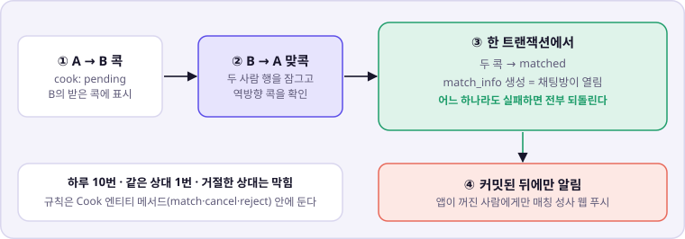
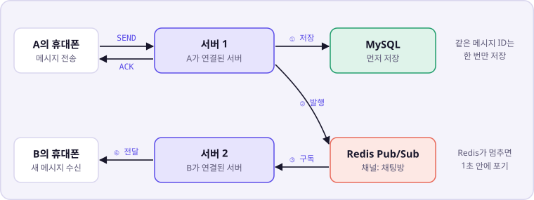
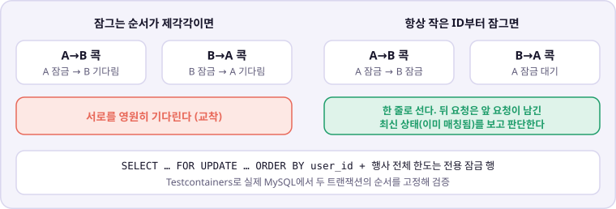
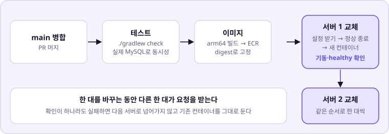

# facecook-be

콕찔러보기의 백엔드다. 참가자끼리 콕을 보내고, 서로 콕하면 매칭해 채팅방을 연다.

2026.09.30 ~ 10.02 축제 3일 동안 **실사용자 445명, 채팅 메시지 6,156건**을 처리했다. 배포 시각을 뺀 서버 오류는 0.002%였다.
서비스 소개와 화면은 [조직 README](https://github.com/seoil-power-rangers)에 있다.

---

## 필요한 문서 찾기

| 하려는 일 | 문서 |
| --- | --- |
| Issue, 브랜치, 커밋과 PR 규칙 확인 | [공통 협업 가이드](./CONTRIBUTING.md) |
| 기능 범위와 정책 확인 | [기능 명세](./docs/기능명세.md) |
| API 요청·응답과 오류 코드 확인 | [API 명세](./docs/API명세.md) |
| 테이블과 마이그레이션 확인 | [ERD](./docs/ERD.md) |
| AWS 구성과 채팅 중계 구조 확인 | [인프라 설계](./docs/인프라설계.md) |
| 배포 파이프라인 확인 | [CI/CD](./docs/CICD.md) |
| 채팅 구현 세부 확인 | [채팅 구현 보고서](./docs/chat_구현보고서.md) |
| 테스트 방식과 장애 대응 확인 | [테스트·장애 대응](./docs/테스트_장애대응.md) |
| 코드를 처음 읽는다 | [백엔드 코드 온보딩](./docs/백엔드_코드_온보딩.md) |

---

## 쉽게 말하면

콕을 받아 매칭하고, 두 서버에 흩어진 사람끼리 채팅을 잇고, 동시에 몰린 요청을 줄 세우고, 서비스를 멈추지 않고 배포한다. 아래 그림 네 장이면 구조가 다 보인다.

### 콕이 채팅방이 되기까지

<picture>
  <source media="(prefers-color-scheme: dark)" srcset="docs/img/cook-to-room-dark.svg">
  
</picture>

매칭과 채팅방 생성은 한 트랜잭션이다. 둘 중 하나만 남는 일은 없다. 푸시는 커밋된 뒤에만 보내서 아직 반영되지 않은 매칭을 알리지 않는다.

### 서버 두 대가 채팅을 잇는다

<picture>
  <source media="(prefers-color-scheme: dark)" srcset="docs/img/chat-relay-dark.svg">
  
</picture>

메시지는 **저장이 먼저**다. 저장한 뒤 Redis 발행을 시도하고, 보낸 사람에게 ACK를 돌려준다. 발행이 실패해도 메시지는 남아 있어 상대 화면이 다음 조회 때 가져간다. 화면이 같은 메시지 ID로 다시 보내도 한 번만 저장된다.

### 동시에 온 콕은 잠그는 순서로 줄 세운다

<picture>
  <source media="(prefers-color-scheme: dark)" srcset="docs/img/lock-order-dark.svg">
  
</picture>

같은 두 사람의 보내기·취소·거절이 동시에 와도 결과는 하나로 정해진다. mock으로는 이 경합을 증명할 수 없어서, 실제 MySQL에서 두 번째 트랜잭션이 잠금에 걸린 것을 확인한 뒤 첫 트랜잭션을 커밋하는 방식으로 순서를 고정해 테스트한다.

### 서버를 한 대씩 바꾼다

<picture>
  <source media="(prefers-color-scheme: dark)" srcset="docs/img/deploy-dark.svg">
  
</picture>

한 대를 바꾸는 동안 다른 한 대가 요청을 받는다. 행사 3일 동안 서비스를 내리지 않고 5번 배포했다.

---

## 어떻게 도는가

```
휴대폰(브라우저·PWA)
   │  HTTPS · WebSocket(STOMP)
   ▼
ALB ──▶ EC2 ×2 (자동 확장 2~4대, Spring Boot 3.4 · Java 21)
            │                         │
            ▼                         ▼
      RDS MySQL 8.4            ElastiCache Redis
      참가자·콕·매칭·채팅          채팅 중계(Pub/Sub) · 접속자 명단
```

**인증은 세션 쿠키 하나다.** 서명한 HttpOnly 쿠키로 REST와 WebSocket을 같은 방식으로 확인한다. 정지된 계정은 이미 연결된 소켓도 다음 메시지부터 막힌다.

### 패키지

레이어가 아니라 **기능별**로 나눈다. 각 패키지 안에 controller·service·repository·entity·dto가 들어간다.

```text
src/main/java/com/facecook/
├── auth/          가입(이메일 인증)·로그인·세션
├── profile/       프로필, 탐색 목록(10초 메모리 보관), 사진 업로드 URL
├── cook/          콕 보내기·취소·거절, 맞콕 시 매칭 생성, 동시 처리 제한
├── match/         매칭 목록·상세·읽음
├── chat/          채팅 REST + STOMP, Redis 중계, 운영 시간
├── mission/       3단계 랜덤 미션, 커밋 뒤 실시간 알림(도메인 이벤트)
├── report/        신고·정지
├── push/          웹 푸시 구독·발송(전용 스레드, 앱이 꺼진 사람에게만)
├── admin/         운영진 통계
├── feedback/      서비스 종료 후 익명 후기
├── common/        예외·세션·로깅·시간(KST)·서비스 종료 차단
└── config/        WebSocket·Redis·CORS·비동기 설정

src/main/resources/db/migration/   Flyway V1 ~ V8
```

---

## 로컬에서 실행하기

JDK 21과 Docker가 필요하다. Docker Compose가 MySQL과 Redis를 띄운다.

```bash
cp -n .env.example .env
docker compose up -d
set -a; source .env; set +a
export SESSION_SECRET="local-$(openssl rand -hex 16)"
./gradlew bootRun
```

`SESSION_SECRET`은 기본값이 없다. 비어 있으면 서버가 뜨지 않는다 — 안전하지 않은 기본값으로 조용히 도는 것보다 낫다고 봤다.

실행하면 Flyway가 마이그레이션을 적용한다. 채팅은 기본 09:00 ~ 18:00에만 보낼 수 있으니, 로컬에서 시험할 때는 `CHAT_OPEN_TIME=00:00 CHAT_CLOSE_TIME=23:59`를 함께 준다.

### 변경 사항 검증

```bash
./gradlew clean check --no-daemon
```

동시성·마이그레이션 테스트는 Testcontainers로 MySQL 8.4(운영과 같은 버전)를 띄운다. **Docker가 없으면 건너뛰지 않고 실패한다.** 잠금을 검증하는 테스트가 조용히 빠진 채 통과하지 않게 하려는 것이다.

---

## 배포

`main`에 병합하면 GitHub Actions가 다음을 한다.

1. 테스트 — PR과 같은 `./gradlew clean check`. 통과해야 이미지를 만든다.
2. arm64 이미지를 빌드해 ECR에 올린다. 배포는 태그가 아니라 **digest**로 해서 두 서버가 같은 이미지를 받는다.
3. SSM으로 서버를 한 대씩 교체한다. 서버마다 Secrets Manager에서 설정을 새로 받고, 기존 컨테이너를 30초 동안 정상 종료한 뒤 새 컨테이너를 띄운다. 이미지·프로세스·ALB healthy를 확인해야 다음 서버로 넘어간다.

**설정은 코드가 아니라 Secrets Manager `facecook/app-env`에 있다.** 행사 중 바꾼 값은 모두 재배포만으로 반영했다.

| 환경 변수 | 기본값 | 쓰임 |
| --- | --- | --- |
| `CHAT_OPEN_TIME` · `CHAT_CLOSE_TIME` | 09:00 · 18:00 | 채팅 운영 시간(행사 때 09:00 ~ 22:00) |
| `SERVICE_END_AT` | 없음 | 이 시각부터 후기 제출을 뺀 모든 API를 401 `SERVICE_ENDED`로 막는다 |
| `COOK_SEND_MAX_CONCURRENT` · `COOK_SEND_MAX_WAIT` | 4 · 500ms | 서버당 콕 동시 처리 수와 대기 상한. 넘으면 429 |
| `REDIS_TIMEOUT` | 1s | Redis 명령 대기 상한. 멈춰도 채팅 전체가 멈추지 않게 |
| `DB_POOL_MAX_SIZE` | 10 | 서버당 DB 연결 수. 서버 4대 × 10 ≤ RDS 최대 연결 60 |

ALB 헬스체크는 `/actuator/health/liveness`(앱 자체 상태만)를 본다. DB나 Redis가 잠깐 멈춰도 두 서버를 비정상으로 판정해 교체하지 않는다.

---

## 운영에서 무엇을 보았나

CloudWatch 대시보드 하나와 알림 네 개를 두었다. 알림은 메일로 온다.

| 알림 | 조건 | 3일 동안 |
| --- | --- | --- |
| 응답 속도 | p95 ≥ 2초, 5분 | 개장 직후 1번(1분) |
| DB CPU | ≥ 90%, 5분 | 0번 |
| 서버 오류 | 5xx ≥ 10건, 5분 | 0번 |
| 서버 최대 도달 | 4대, 5분 | 0번 |

로그로는 세 가지를 남긴다. 500ms 넘는 요청(`SLOW`), DB 연결 대기(`DB 연결 풀 상태`, 대기가 있을 때만), 푸시 실패·거절 수(`푸시 발송 상태`, 30초마다)다.

| 3일 결과 | 값 |
| --- | ---: |
| 처리한 요청 | 440,453건 |
| 1분 p95 중앙값 | 28ms |
| p95가 1초 미만인 분 | 98.8% |
| 앱 서버 CPU 평소 / 최대 | 1~2% / 40%(배포 직후) |
| DB CPU 최대 | 8% |
| 정상 서버 수 | 내내 2대 |

---

## 알려진 한계

운영하면서 드러난 것들이다. 숨기지 않고 남긴다.

| | 규모 | 왜 |
| --- | ---: | --- |
| 첫날 웹 푸시 미발송 | 257회 | 제한 시간을 넣는 변경에서 암호화 제공자 등록 순서가 바뀌었다. 테스트는 제공자를 미리 등록해 두어 가렸다. 10/1 00:17에 고치고 첫 발송 회귀 테스트를 더했다([#153](https://github.com/seoil-power-rangers/facecook-be/issues/153)) |
| 배포 순간 연결 끊김 | 5xx 381건 | 컨테이너를 바꾸는 순간 ALB가 연결에 실패했다. 배포 5번의 시각과 모두 겹친다. 연결을 넘기는 드레이닝을 다듬어야 한다 |
| 사진 업로드 중단에 500 | 8건 | 사용자 연결이 끊긴 요청을 400이 아니라 500으로 응답했다 |
| 인증 메일 지연 | 평균 2.3초 | 메일 발송을 요청 안에서 기다린다. 느린 요청 로그의 68%가 이것이었다 |
| Redis 발행 실패 시 실시간 누락 | — | 저장은 되지만 상대에게 즉시 가지 않는다. 화면의 다음 조회가 메운다 |

---

<sub>작업 방식은 [CONTRIBUTING.md](./CONTRIBUTING.md)를 따른다. 화면(UI)은 [facecook-fe](https://github.com/seoil-power-rangers/facecook-fe)의 책임이다.</sub>
