# face 콕 백엔드 코드 온보딩

정리 기준일: 2026-09-25 · 관련 이슈: #116

이 문서는 처음 합류한 사람이 **facecook-be 코드를 따라 읽으며** 익히기 위한 안내서다.
"이 기능은 어디서 시작해서 어디를 거쳐 무엇이 나오는가"를 기능마다 같은 틀로 설명한다.

- **대상 독자**: Java 문법은 알지만 Spring은 처음인 사람. Spring·JPA·Lombok 기능이 나올 때마다 뜻과 **이 코드에서 왜 썼는지**를 같이 적었다.
- **환경 세팅**(Docker, JDK 설치)은 [온보딩.md](./온보딩.md), API 요청·응답 형식은 [API명세.md](./API명세.md), 테이블 컬럼은 [ERD.md](./ERD.md)를 본다. 이 문서는 그 사이, **코드가 어떻게 연결돼 있는지**를 다룬다.
- 코드 안의 주석(클래스·메서드 설명)과 짝을 이룬다. 문서에서 `AuthService.requestCode`를 가리키면, 그 메서드를 열었을 때 같은 설명(전제조건·부작용·예외)이 이어지게 맞춰 두었다.
- 같은 내용의 HTML 버전: [백엔드_코드_온보딩.html](./백엔드_코드_온보딩.html). md를 고친 뒤 `python3 docs/tools/build_onboarding_html.py`로 다시 만든다.

---

## 0. 읽는 순서와 진행 상황

처음이라면 **1장 → 2장 → 3장(원하는 기능)** 순서로 읽고, 코드를 열 때마다 해당 장의 "관련 파일" 표를 옆에 둔다. 8장 "따라 해보기"는 1·2장을 읽은 뒤 해 보면 흐름이 손에 잡힌다.

| 장 | 내용 | 상태 |
| --- | --- | --- |
| 1 | 한눈에 보기 (서비스, 인프라, 패키지 지도) | 작성 |
| 2 | 공통 뼈대 (요청 하나가 지나가는 길, 로그인 확인, 오류, 시각, 트랜잭션, 설정, 문법) | 작성 |
| 3.1~3.2 | 가입·로그인, 프로필 | 작성 |
| 3.3~3.5 | 콕, 매칭, 채팅 | 작성 |
| 3.6~3.7 | 미션, 푸시 | 작성 |
| 3.8~3.9 | 신고, 관리자·슈퍼 계정 | 작성 |
| 4 | 실시간·비동기 | 작성 |
| 5~9 | 데이터, 배포·운영, 테스트, 따라 해보기, 용어집 | 작성 |

---

## 1. 한눈에 보기

### 1.1 서비스가 하는 일

제52회 용마대동제 소개팅 부스 **콕찔러보기**의 백엔드다. 참가자 입장에서 흐름은 이렇다.

1. 이메일 인증으로 **가입**하고 **프로필**(닉네임, MBTI, 학과 등)을 작성한다.
2. **탐색** 화면에서 다른 참가자를 보고 마음에 들면 **콕**을 보낸다(하루 한도 있음).
3. 서로 콕을 보내면(**맞콕**) **매칭**이 성사되고 **채팅**방이 열린다.
4. 매칭된 두 사람은 부스에서 **미션**(STEP 1~3)을 수행하고, 운영진(관리자)이 완료를 확인한다.
5. 앱을 닫아 두면 콕·매칭·메시지를 **웹 푸시**로 알려 준다.
6. 불편한 상대는 **신고**할 수 있고, 관리자가 처리한다. **슈퍼 계정**은 전체를 열람할 수 있다.

### 1.2 인프라 그림

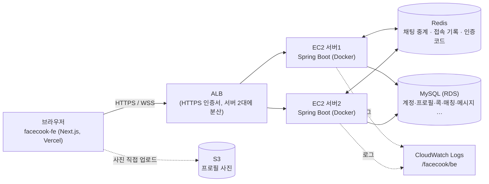

- 서버가 **2대**라는 점이 코드 곳곳에 영향을 준다. 사용자 A는 서버1, B는 서버2에 붙어 있을 수 있어서, 채팅 메시지는 Redis를 거쳐 양쪽 서버로 퍼진다(3.5장). 서버 한 대의 메모리에만 두는 상태는 다른 서버가 모른다.
- 사진은 서버를 거치지 않는다. 서버는 "S3에 올려도 되는 서명된 주소"만 만들어 준다(3.2장).
- 자세한 인프라 결정 배경은 [인프라설계.md](./인프라설계.md).

### 1.3 기술 스택

| 기술 | 어디에 | 이 프로젝트에서 쓰는 이유 |
| --- | --- | --- |
| Java 21 | 전체 | `record`, `switch` 식, 텍스트 블록 등 코드를 짧게 쓰는 문법을 쓴다(2.9장) |
| Spring Boot 3.4 | 서버 뼈대 | 객체 생성·연결(DI), 웹 서버, 설정 파일 읽기를 대신 해 준다 |
| Spring MVC | REST API | `@RestController`로 HTTP 요청을 메서드에 연결한다 |
| Spring Data JPA (Hibernate) | DB 접근 | SQL 대신 엔티티 객체로 읽고 쓴다. 단순 조회는 메서드 이름만으로 쿼리가 만들어진다 |
| MySQL 8 | 영구 저장 | 계정·프로필·콕·매칭·메시지·미션·신고·푸시 구독 |
| Flyway | DB 스키마 버전 관리 | `db/migration/V*.sql`을 순서대로 적용해서 모든 환경의 테이블 구조를 같게 유지한다 |
| Redis | 짧게 쓰는 데이터 | 인증코드(5분), 채팅 서버 간 중계(Pub/Sub), 접속 기록 |
| WebSocket + STOMP | 실시간 | 채팅 메시지, 미션 진행 알림 |
| Lombok | 반복 코드 줄이기 | getter, 생성자, 로거를 어노테이션으로 만든다 |
| Testcontainers | 테스트 | 테스트 중에 진짜 MySQL·Redis를 도커로 띄워 동시성 같은 동작을 실제 DB로 검증한다 |

### 1.4 패키지 지도

소스는 `src/main/java/com/facecook/` 아래에 **기능(도메인)별 패키지**로 나뉜다.

| 패키지 | 한 줄 설명 | 장 |
| --- | --- | --- |
| `common` | 모든 기능이 같이 쓰는 뼈대: 로그인 확인, 오류 처리, 한국 시간, 느린 요청 로그 | 2 |
| `config` | 스프링 설정: 웹(CORS·인터셉터), WebSocket, 비동기 실행기, 스케줄러, S3, Redis 구독 | 2 |
| `auth` | 가입·로그인, 계정(`users`), 인증 메일, 활동 시각 | 3.1 |
| `profile` | 프로필 작성·조회·수정, 탐색 목록·필터, 사진 업로드 주소 | 3.2 |
| `cook` | 콕 보내기·받기·취소·거절, 하루 한도 | 3.3 |
| `match` | 매칭 목록·상세, 읽음 처리 | 3.4 |
| `chat` | 채팅 REST·WebSocket, Redis 중계, 접속 기록 | 3.5 |
| `mission` | 매칭별 미션 배정·진행, 관리자 완료 처리 | 3.6 |
| `push` | 웹 푸시 구독·발송 | 3.7 |
| `report` | 신고와 관리자 처리(정지) | 3.8 |
| `admin` | 관리자 통계 | 3.9 |
| `superaccount` | 슈퍼 계정 생성·전체 열람 | 3.9 |

### 1.5 패키지 안의 공통 구조

기능 패키지는 대부분 같은 하위 폴더를 가진다. 요청은 **위에서 아래로** 내려가고, 결과는 거꾸로 올라온다.

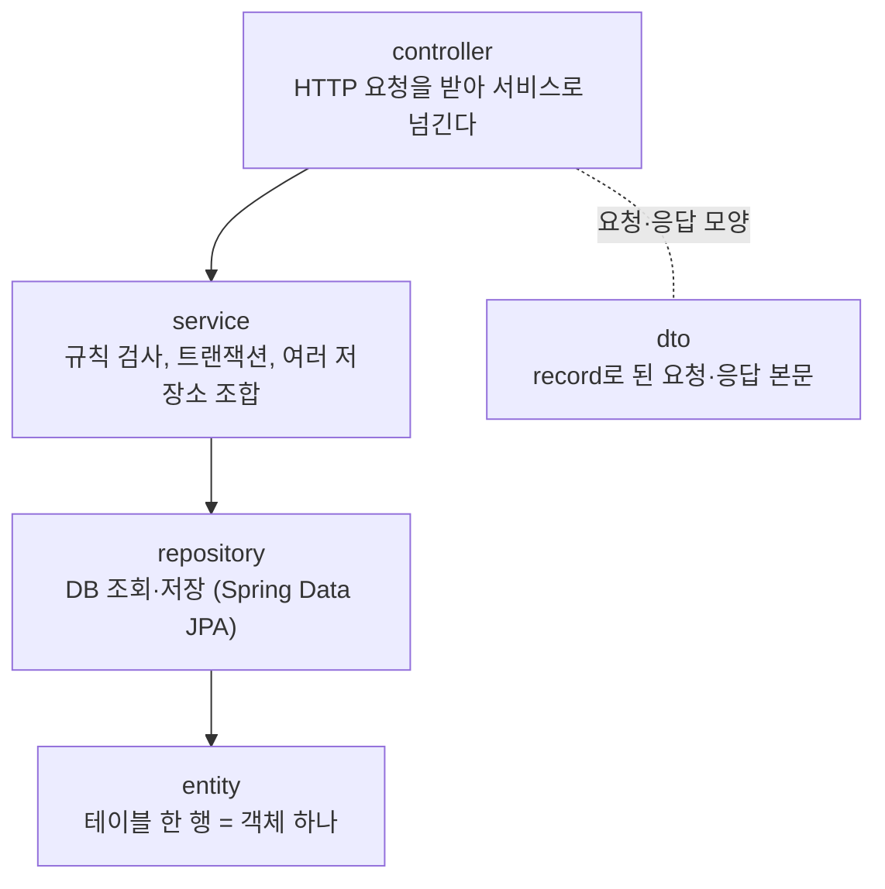

| 폴더 | 역할 | 규칙 |
| --- | --- | --- |
| `controller` | URL과 메서드 연결, 요청 본문 검증(`@Valid`), 서비스 호출 | 규칙(한도, 권한 등)을 여기 두지 않는다 |
| `service` | 기능의 규칙과 순서. `@Transactional`로 DB 작업을 묶는다 | 전제조건·부작용·예외를 Javadoc에 적는다 |
| `repository` | 인터페이스만 선언하면 스프링이 구현을 만든다 | 복잡한 조회는 `@Query` |
| `entity` | 테이블과 연결된 클래스. 상태를 바꾸는 메서드만 연다 | setter를 열지 않는다 |
| `dto` | API 요청·응답 본문. 대부분 `record` | 엔티티를 그대로 응답하지 않는다 |

엔티티를 그대로 응답하지 않는 이유: 테이블 구조가 바뀌면 API 응답도 같이 바뀌어 FE가 깨지고, 비밀번호 해시 같은 내부 값이 실수로 나갈 수 있다. 그래서 `ProfileResponse.from(profile, ...)`처럼 응답용 record로 옮겨 담는다.

---

## 2. 공통 뼈대

기능 코드를 읽기 전에 알아야 하는, **모든 요청이 공통으로 지나가는 부분**이다.

### 2.1 서버가 켜질 때: 빈과 생성자 주입

`FacecookBeApplication`의 `@SpringBootApplication`이 `com.facecook` 아래의 `@Component`, `@Service`, `@RestController`, `@Configuration`이 붙은 클래스를 찾아 **객체(빈)를 하나씩 만들고 서로 연결**한다. 그래서 코드 어디에도 `new AuthService(...)`가 없다.

```java
@Service
@RequiredArgsConstructor           // Lombok: final 필드를 받는 생성자를 만들어 준다
public class AuthService {
    private final UserRepository userRepository;       // 스프링이 만든 빈이 생성자로 들어온다
    private final VerificationCodeService verificationCodeService;
    ...
}
```

- **왜 생성자 주입인가**: 필드가 `final`이라 한 번 들어오면 바뀌지 않고, 테스트에서는 `new AuthService(가짜저장소, ...)`처럼 원하는 가짜 객체를 넣어 만들 수 있다. 이 프로젝트 단위 테스트 대부분이 이렇게 Mockito 가짜를 넣어 서비스를 직접 만든다.
- **왜 Lombok인가**: 필드가 5개면 생성자·대입 코드가 10줄 넘게 늘어난다. `@RequiredArgsConstructor`가 그걸 대신 만든다.

### 2.2 요청 하나가 지나가는 길

`GET /api/profile`(내 프로필 조회)을 예로 든다.

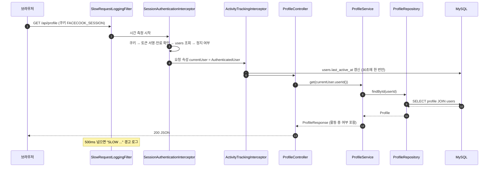

| 단계 | 클래스 | 하는 일 | 실패하면 |
| --- | --- | --- | --- |
| 필터 | `SlowRequestLoggingFilter` | 전체 처리 시간을 재서 느린 요청만 로그로 남긴다 | (실패 없음) |
| 인터셉터 1 | `SessionAuthenticationInterceptor` | 세션 쿠키로 로그인 확인 | 401 `UNAUTHORIZED`, 정지면 403 `SUSPENDED` |
| 인터셉터 2 | `ActivityTrackingInterceptor` | 마지막 활동 시각 기록 | 실패해도 요청은 계속 |
| 컨트롤러 | `*Controller` | 요청 본문 검증, 서비스 호출 | 400 `VALIDATION` |
| 서비스 | `*Service` | 규칙 검사와 DB 작업 | `ApiException` → 각 상태 |

- **필터와 인터셉터의 차이**: 필터는 서블릿(웹 서버) 단계에서 모든 요청을 감싸고, 인터셉터는 스프링 MVC가 컨트롤러를 부르기 직전·직후에 끼어든다. 인터셉터는 `WebConfig.addInterceptors`에서 **등록한 순서대로** 실행된다 — 활동 기록은 "누구의 활동인지"가 필요해서 로그인 확인 다음에 등록했다.
- **로그인 전에 부르는 API**(`/api/auth/request-code`, `verify-signup`, `verify-login`, `login`, `logout`)는 `WebConfig.PUBLIC_AUTH_PATHS`로 두 인터셉터에서 빠진다. 나머지 `/api/**`는 전부 로그인이 필요하다.

### 2.3 로그인 확인: 세션 쿠키와 토큰

이 프로젝트는 서버 메모리나 DB에 "세션 목록"을 저장하지 않는다. 대신 **서명된 토큰**을 쿠키에 담는다.

```
FACECOOK_SESSION = base64url("42:1790783011") + "." + base64url(HMAC-SHA256 서명)
                              userId  만료시각(초)
```

| 단계 | 클래스 | 설명 |
| --- | --- | --- |
| 발급 | `SessionTokenSigner.issue` ← `SessionCookieService.issue` ← `AuthController` | 로그인·가입 성공 시. 서명 키는 환경변수 `SESSION_SECRET` |
| 쿠키 | `SessionCookieService` | `HttpOnly`(자바스크립트가 못 읽음), `SameSite`, `Secure`, 7일 |
| 검증 | `SessionAuthenticator.authenticate` | 서명·만료 확인 → `users`에서 계정 조회 → 정지 여부 |

- **왜 서버에 세션을 저장하지 않나**: 서버가 2대라, 한 서버 메모리에 세션을 두면 다른 서버로 간 요청은 로그인이 풀린다. 서명된 토큰은 어느 서버든 같은 키로 확인할 수 있다.
- **왜 매 요청 DB를 다시 보나**: 토큰에는 userId와 만료만 들어 있다. 역할·정지 여부를 토큰에 넣으면, 신고로 정지된 사람이 이미 받은 토큰으로 7일 동안 계속 쓸 수 있다. 매번 `users`를 읽어서 정지가 **다음 요청부터 바로** 반영되게 했다.
- **한 곳에 모은 이유**: HTTP 요청, WebSocket 연결, STOMP 메시지가 모두 `SessionAuthenticator` 하나를 거친다. 예전엔 세 곳이 같은 순서를 복사해 두어 한쪽만 고쳐지는 구멍이 생길 수 있었다(이슈 #76).

### 2.4 컨트롤러가 로그인 사용자를 받는 법: `@CurrentUser`

```java
@GetMapping("/profile")
public ResponseEntity<ProfileResponse> getMine(@CurrentUser AuthenticatedUser currentUser) {
    return ResponseEntity.ok(profileService.get(currentUser.userId()));
}
```

1. `SessionAuthenticationInterceptor`가 요청 속성 `currentUser`에 `AuthenticatedUser`를 넣는다.
2. 스프링이 컨트롤러를 부르기 전에 파라미터를 채울 방법을 찾는다. `@CurrentUser`가 붙은 `AuthenticatedUser` 파라미터는 `CurrentUserArgumentResolver`가 맡아서 그 속성을 꺼내 준다.

**"내 것"을 다루는 API는 경로에 userId를 받지 않는다.** `PATCH /api/profile`은 세션의 userId만 쓰기 때문에, 남의 프로필을 고치는 요청을 만들 방법이 없다.

### 2.5 오류 처리: `ApiException` → `GlobalExceptionHandler`

서비스는 규칙에 어긋나면 예외를 던진다.

```java
if (profileRepository.existsById(userId)) {
    throw new ApiException(ErrorCode.PROFILE_ALREADY_EXISTS);   // 409
}
```

`GlobalExceptionHandler`(`@RestControllerAdvice`)가 받아서 `ErrorCode`의 상태 코드와 아래 JSON으로 바꾼다.

```json
{ "code": "PROFILE_ALREADY_EXISTS", "message": "이미 프로필이 등록되어 있습니다." }
```

| 상황 | 예외 | 응답 |
| --- | --- | --- |
| 규칙상 거절(한도, 중복, 권한 등) | `ApiException(ErrorCode.X)` | `X`의 상태 + `{"code":"X"}` |
| 요청 본문 검증 실패(`@Valid`) | `MethodArgumentNotValidException` | 400, 첫 번째 필드의 메시지 |
| 경로·쿼리 값 검증 실패(`@Validated` 컨트롤러) | `ConstraintViolationException` | 400 |
| JSON 형식이 깨짐, enum 값이 틀림 | `HttpMessageNotReadableException` | 400 |
| `?limit=abc`, 필수 파라미터 누락 | `MethodArgumentTypeMismatchException` 등 | 400 |
| 없는 HTTP 메서드·Content-Type | 405 / 415 | 본문 없음, `Allow`/`Accept` 헤더 |
| 그 밖의 모든 예외 | `Exception` | 500 `INTERNAL_ERROR` + 에러 로그 |

- **왜 `RuntimeException`을 상속했나**: 메서드마다 `throws`를 쓰지 않아도 되고, `@Transactional`은 기본적으로 unchecked 예외가 나면 **롤백**한다. 서비스 중간에 `ApiException`을 던지면 그때까지 쓴 DB 변경도 취소된다.
- **FE는 `message`가 아니라 `code`로 분기한다.** 문구는 바뀔 수 있어도 코드 이름은 계약이다. 새 코드를 만들면 [API명세.md](./API명세.md) 10절 표도 고친다.
- 4xx(`ApiException`)도 경고 로그를 남긴다. 부하가 몰릴 때 어떤 API에서 어떤 거절이 많은지 로그로 셀 수 있게 하기 위해서다.
- WebSocket(STOMP)에서 난 오류는 이 클래스가 아니라 `ChatStompErrorHandler`가 같은 모양의 ERROR 프레임으로 만든다(3.5장).

### 2.6 시각: `Clock`과 `EventTime`

| 무엇 | 기준 | 쓰는 곳 |
| --- | --- | --- |
| `Clock` 빈 (`SessionConfig`) | UTC | 세션 만료처럼 **절대 시각**이 필요한 계산 |
| `EventTime.now(clock)`, `EventTime.today(clock)` | 한국 시간(Asia/Seoul) | DB에 저장하고 화면에 보여 주는 **모든 시각**, "오늘" 판정(하루 한도 등) |
| DB 기본값(`CURRENT_TIMESTAMP`) | 한국 시간 | 커넥션마다 `SET time_zone = '+09:00'`(`application.yml`의 `connection-init-sql`) |

- **왜 `LocalDateTime.now()`를 직접 안 쓰나**: 서버 컨테이너는 UTC로 돈다. `now()`를 바로 쓰면 9시간 어긋난 시각이 저장된다. 실제로 미션 완료·가입 시각이 UTC로 저장된 적이 있어서(#77), 사람이 보는 시각은 전부 `EventTime`을 거치게 했다.
- **왜 `Clock`을 주입받나**: 테스트에서 `Clock.fixed(...)`를 넣으면 "행사 날(9/30)에만 적용되는 한도"처럼 날짜에 따라 달라지는 동작을 원하는 날짜로 재현할 수 있다.
- API 응답 시각은 오프셋 없는 한국 시간 문자열이다(`2026-09-30T14:32:00`). FE는 `serverTime.ts`로 한국 시간으로 해석한다.

### 2.7 트랜잭션 기초

```java
@Transactional
public ProfileResponse update(Long userId, UpdateProfileRequest request) {
    Profile profile = findProfile(userId);
    profile.update(toEdit(request));      // save()를 안 불러도 커밋 때 UPDATE가 나간다
    return activityLookup.toResponse(profile);
}
```

- **`@Transactional`**: 메서드 시작에 트랜잭션을 열고, 정상 종료면 커밋, unchecked 예외면 롤백한다. 메서드 안의 여러 DB 작업이 **다 되거나 다 안 되거나**가 된다.
- **변경 감지**: 트랜잭션 안에서 조회한 엔티티의 필드를 바꾸면, JPA가 커밋 직전에 바뀐 부분을 UPDATE로 보낸다. 위 코드에 `save`가 없는 이유다.
- **`@Transactional(readOnly = true)`**: 조회만 하는 메서드에 붙인다. 변경 감지 준비를 생략해서 조금 가볍고, "여기서는 쓰지 않는다"는 의도가 드러난다.
- **커밋 후에 실행하기**: DB 커밋이 확정된 뒤에만 해야 하는 일(인증코드 지우기, 푸시 보내기)은 `TransactionSynchronizationManager.registerSynchronization(... afterCommit ...)`으로 미룬다. 예: 가입 저장이 롤백됐는데 인증코드를 먼저 지워 버리면, 사용자는 같은 코드로 다시 시도할 수 없다(`AuthService.consumeCodeAfterCommit`).
- **주의**: `@Transactional`과 `@Async`는 스프링이 **다른 빈에서 호출할 때** 가로채서 동작한다. 같은 클래스 안에서 `this.method()`로 부르면 적용되지 않는다.

### 2.8 설정값: `application.yml`과 환경변수

설정은 `src/main/resources/application.yml`에 있고, 값은 대부분 `${환경변수:기본값}` 형태로 환경변수에서 온다. 운영 서버의 환경변수 파일은 `/opt/facecook/app.env`다.

| 환경변수 | 쓰는 곳 | 없으면 |
| --- | --- | --- |
| `SESSION_SECRET` | 세션 토큰 서명 | **서버가 뜨지 않는다**(`SessionProperties`가 막음) |
| `DB_URL`, `DB_USERNAME`, `DB_PASSWORD` | MySQL | 로컬 기본값(`docker-compose.yml`과 같은 값) |
| `REDIS_HOST`, `REDIS_PORT` | Redis | `localhost:6379` |
| `CORS_ALLOWED_ORIGINS` | 허용할 FE 주소 | `localhost:3000,3001` |
| `SMTP_*` | 인증 메일(Brevo) | 인증코드 발송 실패(`EMAIL_SEND_FAILED`) |
| `VAPID_PUBLIC_KEY`, `VAPID_PRIVATE_KEY` | 웹 푸시 | 푸시 발송 실패(로그만) |
| `SUPER_ACCOUNT_LOGIN`, `SUPER_ACCOUNT_PASSWORD` | 슈퍼 계정 자동 생성 | 슈퍼 계정을 만들지 않음 |
| `S3_BUCKET`, `AWS_REGION` | 사진 업로드 주소 | 업로드 주소가 잘못 만들어짐 |
| `COOK_REJECT_ENABLED` | 받은 콕 거절 API | 꺼짐 |

환경변수 없이 파일에 고정된 서버 설정도 있다. `server.compression`은 JSON 응답을 gzip으로 압축한다(클라이언트가 `Accept-Encoding: gzip`을 보낼 때, 2KB 이상인 응답만). 참가자 900명 기준 `GET /api/profiles`가 압축 전 약 226KB, 압축 후 약 8KB였다(#125, 테스트 데이터로 로컬 측정). 압축은 Tomcat이 하므로 `MockMvc` 테스트에는 보이지 않는다 — `ResponseCompressionConfigTest`가 설정값을 확인한다.

**설정을 코드로 받는 방법**: `@ConfigurationProperties(prefix = "app.session") record SessionProperties(...)`처럼 설정 묶음을 record로 선언하면, 스프링이 설정 파일을 읽어 record를 만들고 빈으로 등록한다. record의 compact 생성자에서 기본값을 채우거나 필수값을 검사한다.

### 2.9 자주 보는 Java·Lombok 문법과 쓰는 이유

| 문법 | 예 | 이 코드에서 쓰는 이유 |
| --- | --- | --- |
| `record` | `record ProfileResponse(Long userId, String nickname, ...)` | 요청·응답·설정처럼 **만든 뒤 바뀌면 안 되는 값 묶음**. 생성자·getter·`equals`가 자동으로 생기고 Jackson이 필드명 그대로 JSON으로 바꾼다 |
| record compact 생성자 | `public SessionProperties { if (secret == null) throw ...; }` | 값이 만들어지는 순간 검증·기본값 채우기 |
| 값을 가진 `enum` | `DAILY_LIMIT(HttpStatus.TOO_MANY_REQUESTS, "...")` | 정해진 목록(오류 코드, 역할). 오타로 없는 값을 만들 수 없고 관련 값이 한 줄에 붙어 있다 |
| 정적 팩토리 | `User.createParticipant(email, now)` | 생성자를 `private`/`protected`로 막고 이름 있는 메서드로만 만든다. "참가자"와 "슈퍼 계정"을 만드는 규칙이 이름으로 드러난다 |
| `Optional<T>` | `userRepository.findByEmail(email).orElseThrow(...)` | "없을 수 있음"을 `null` 대신 타입으로 드러내 호출부가 빈 경우를 처리하게 한다 |
| `instanceof` 패턴 | `if (obj instanceof AuthenticatedUser user) { user.userId() }` | 형 검사와 형 변환을 한 번에 |
| `switch` 식 | `switch (result.outcome()) { case UNAUTHORIZED -> throw ...; }` | 모든 경우를 처리했는지 컴파일러가 확인해 준다 |
| 텍스트 블록 | `""" 인증번호: %s """.formatted(code)` | 여러 줄 문자열(메일 본문, 긴 `@Query` 쿼리) |
| `@Getter` (Lombok) | 엔티티 클래스 위 | getter만 만들고 setter는 만들지 않는다 |
| `@RequiredArgsConstructor` | 서비스 클래스 위 | `final` 필드 생성자 → 생성자 주입 |
| `@NoArgsConstructor(access = PROTECTED)` | 엔티티 | JPA가 조회 결과로 객체를 만들 때 필요한 빈 생성자. 코드에서 실수로 쓰지 못하게 `protected` |
| `@Slf4j` | 클래스 위 | `log.warn(...)` 로거 필드를 만든다 |
| `static final` 상수 | `CODE_TTL_SECONDS = 5 * 60` | 규칙 값(5분, 30초)을 이름으로 드러내고, 테스트·응답에서 같은 값을 공유한다 |

---

## 3. 기능별 흐름

각 기능은 같은 틀로 설명한다: **무슨 기능인지 → API → 호출 흐름 → 핵심 규칙 → 관련 파일 → 관련 테스트**.

### 3.1 가입·로그인 (`auth`)

#### 무슨 기능인가

이메일 인증코드로 가입하고 로그인한다. 로그인 방법은 두 가지이고 **대상이 다르다**.

| 방법 | API | 누가 |
| --- | --- | --- |
| 이메일 인증코드 | `request-code` → `verify-login` | **참가자만** |
| 이메일 + 비밀번호 | `login` | 참가자·관리자·슈퍼 모두 |

가입(`verify-signup`)할 때 비밀번호를 같이 정한다. 관리자·슈퍼 계정은 인증코드 로그인을 쓸 수 없다(`AuthService.findParticipant`가 역할을 걸러냄).

#### API

| API | 컨트롤러 → 서비스 | 결과 |
| --- | --- | --- |
| `POST /api/auth/request-code` | `AuthController.requestCode` → `AuthService.requestCode` | 메일 발송, `{expiresInSeconds: 300, resendAfterSeconds: 30}` |
| `POST /api/auth/verify-signup` | `.verifySignup` → `AuthService.verifyCodeAndCreateParticipant` | 계정 생성 + 세션 쿠키 |
| `POST /api/auth/verify-login` | `.verifyLogin` → `AuthService.verifyLogin` | 세션 쿠키 |
| `POST /api/auth/login` | `.login` → `AuthService.login` | 세션 쿠키 |
| `GET /api/auth/me` | `.me` (서비스 없음) | 세션의 사용자 정보 |
| `POST /api/auth/logout` | `.logout` → `SessionCookieService.clear` | 쿠키 삭제 |

#### 호출 흐름 ① 인증코드 발급

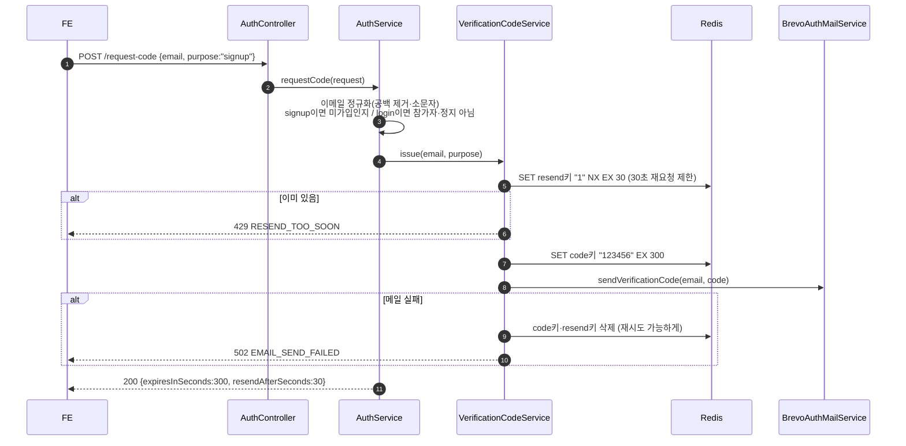

#### 호출 흐름 ② 가입 완료

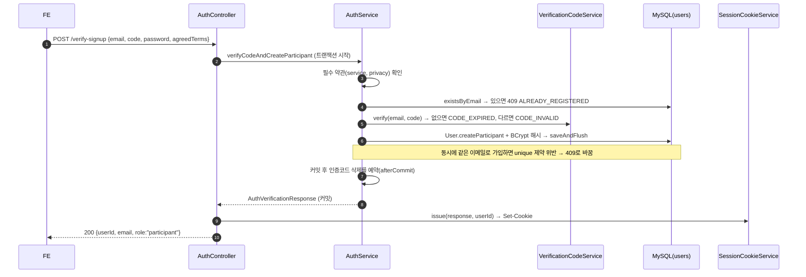

가입 직후에는 프로필이 없다. FE의 `RequireProfile`이 `GET /api/profile`의 `PROFILE_NOT_FOUND`를 보고 온보딩(프로필 작성) 화면으로 보낸다(3.2장).

#### 핵심 규칙과 이유

| 규칙 | 어디 | 이유 |
| --- | --- | --- |
| 인증코드는 DB가 아니라 Redis에 5분 | `VerificationCodeService` | 짧게 쓰고 버리는 값이라 만료(TTL)를 Redis가 알아서 처리한다 |
| Redis 키에 이메일 대신 SHA-256 해시 | `VerificationCodeService.key` | Redis 콘솔·로그에 실제 이메일이 보이지 않게 |
| 키 구조 `auth:verification:{signup\|login}:{해시}:{code\|resend}` | 같은 곳 | 가입용 코드로 로그인할 수 없게 목적별로 분리 |
| 30초 재요청 제한을 `setIfAbsent`로 | `issue` | "확인 후 저장"을 한 번에 해서 동시 요청 두 개가 둘 다 통과하지 못한다 |
| 메일 실패 시 방금 만든 키를 지움 | `issue` | "메일은 안 갔는데 30초 제한만 걸린" 상태가 남지 않게 |
| 코드 비교에 `MessageDigest.isEqual` | `verify`, 세션 서명 비교 | 비교 시간이 앞자리 일치 개수에 따라 달라지지 않게 |
| 인증코드 소비는 커밋 후 | `consumeCodeAfterCommit` | 가입 저장이 실패하면 같은 코드로 다시 시도할 수 있게 |
| 비밀번호는 BCrypt 해시로만 저장 | `PasswordConfig`, `User.setPassword` | 평문을 저장하지 않는다 |
| 이메일이 없을 때도 더미 해시와 비교 | `AuthService.invalidCredentialsAfterDummyComparison` | "없는 이메일"과 "틀린 비밀번호"의 응답 시간이 같아야 가입 여부를 알아낼 수 없다. 오류 코드도 둘 다 `INVALID_CREDENTIALS` |
| 이메일은 항상 정규화 | `EmailAddress.normalize` | `"A@x.com "`과 `"a@x.com"`을 같은 계정으로 |

#### 활동 시각 기록

로그인한 사용자의 모든 API 요청마다 `ActivityTrackingInterceptor` → `UserActivityService.touch`가 `users.last_active_at`을 갱신한다. 프로필의 "활동 중" 표시(3.2장)와 관리자 통계의 근거다.

- FE가 5초마다 조회하는 화면이 많아서, 그대로 두면 요청마다 UPDATE가 나간다. 그래서 **30초 안에 이미 갱신됐으면 쓰지 않는다**.
- 이 판단을 코드에서 먼저 읽고 비교하지 않고, UPDATE 문의 `WHERE last_active_at < (지금-30초)`에 넣었다(`UserRepository.touchLastActiveAt`). 조건에 맞는 행이 없으면 쓰기가 아예 일어나지 않아 조회 한 번을 아낀다.

#### 관련 파일

| 파일 | 역할 |
| --- | --- |
| `auth/controller/AuthController` | API 6개, 세션 쿠키 발급·삭제 |
| `auth/service/AuthService` | 가입·로그인 규칙(두 로그인 경로의 대상 차이 포함) |
| `auth/service/VerificationCodeService` | 인증코드 발급·확인·소비(Redis) |
| `auth/service/UserActivityService` | 마지막 활동 시각 |
| `auth/mail/AuthMailService`, `BrevoAuthMailService` | 메일 발송(인터페이스와 Brevo SMTP 구현) |
| `auth/entity/User`, `UserRole`, `UserStatus`, `*Converter` | `users` 테이블, 역할·상태(DB에는 소문자) |
| `auth/repository/UserRepository` | `users` 조회·저장, 활동 시각 벌크 UPDATE |
| `auth/support/EmailAddress` | 이메일 정규화 |
| `auth/config/PasswordConfig` | BCrypt 빈 |
| `common/session/*` | 세션 토큰·쿠키·인증(2.3장) |

#### 관련 테스트

`AuthServiceTest`(두 로그인 경로, 역할별 비밀번호 로그인, 더미 해시 비교, 정지 계정), `VerificationCodeServiceTest`(재요청 제한, 메일 실패 시 롤백, 만료·불일치), `AuthControllerTest`(쿠키 발급·삭제, 위조·정지 쿠키 거절, CORS preflight), `UserActivityServiceTest`, `BrevoAuthMailServiceTest`, 그리고 `common/session`의 `SessionTokenSignerTest`·`SessionAuthenticatorTest`·`SessionAuthenticationInterceptorTest`, 정지 계정이 HTTP·WebSocket 모든 진입점에서 막히는지 보는 `SuspendedAccountEntryPointsTest`.

---

### 3.2 프로필 (`profile`)

#### 무슨 기능인가

가입한 참가자가 온보딩에서 프로필을 한 번 만들고, 마이페이지에서 일부(학과·학년·자기소개·사진)를 고친다. 다른 참가자는 탐색 화면에서 목록·필터·상세로 본다.

#### API

| API | 서비스 | 쓰는 화면(FE) |
| --- | --- | --- |
| `POST /api/profile/photo/upload-url` | `ProfilePhotoUploadService.issueUploadUrl` | 사진 선택 |
| `POST /api/profile` | `ProfileService.create` | 온보딩 마지막 단계 |
| `GET /api/profile` | `ProfileService.get` (내 userId) | 메인·마이페이지, 온보딩 여부 확인 |
| `PATCH /api/profile` | `ProfileService.update` | 마이페이지 수정 |
| `GET /api/profiles` | `ProfileService.getParticipantsExcept` | 탐색 목록 |
| `GET /api/profiles/filters?active=` | `ProfileService.getFilters` | 탐색 필터 선택지 |
| `GET /api/profiles/{userId}` | `ProfileService.get` | 프로필 상세 |
| `GET /api/stats` | `ProfileService.getStats` | 메인 "총 사용자" |
| `GET /api/departments` | `ProfileService.getDepartments` | 학과 선택(정적 목록) |

#### 호출 흐름 ① 사진 올리고 프로필 만들기

서버는 사진 파일을 받지 않는다. **S3에 직접 올릴 수 있는 서명된 주소**만 발급한다.

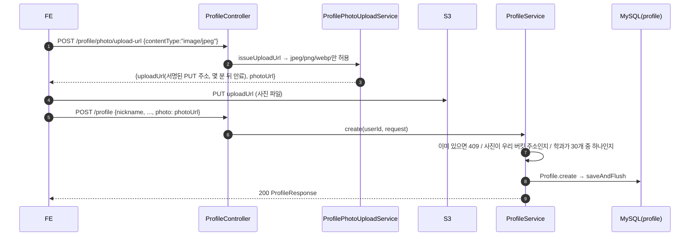

- **왜 서버를 거치지 않나**: 사진 파일이 서버 2대의 메모리·네트워크를 차지하지 않는다. 서버는 "이 주소로, 이 형식으로, 몇 분 안에만" 올릴 수 있는 서명만 만든다(S3에는 아무것도 쓰지 않는다).
- **파일 이름은 무작위 UUID**: `profile-photos/{uuid}.jpg`. 사용자 ID 같은 추측 가능한 값을 쓰면 남의 사진 주소를 유추할 수 있다.
- **`storageClass`를 지정하지 않는 이유**: 지정하면 서명 대상 헤더에 들어가서, FE가 같은 헤더를 보내지 않으면 S3가 403(서명 불일치)을 낸다. 실제로 겪은 장애다(`ProfilePhotoUploadService` 주석).

#### 호출 흐름 ② 탐색 목록 (N+1 막기)

`GET /api/profiles`는 참가자 수백 명을 한 번에 돌려준다. 각 프로필마다 "활동 중"을 판단하려면 `users.last_active_at`이 필요하다.

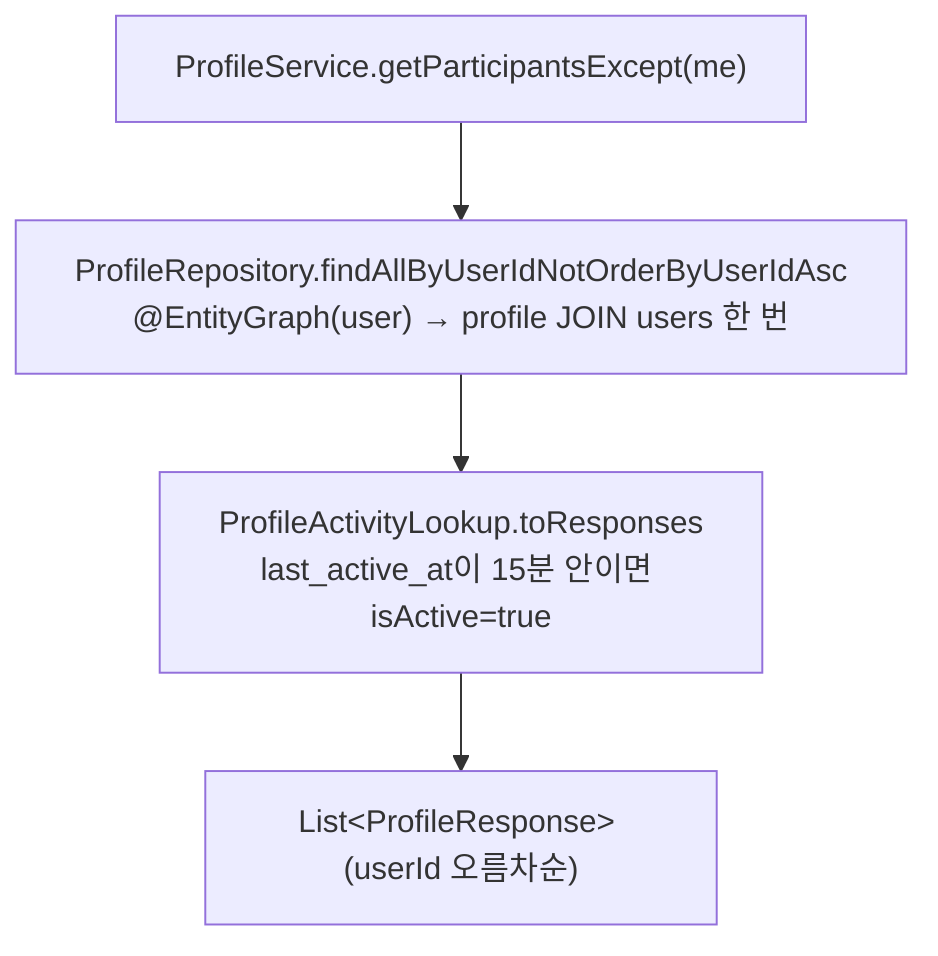

- **N+1 문제**: 프로필 300개를 가져온 뒤 각 프로필의 `user`를 건마다 따로 조회하면 SQL이 1 + 300번 나간다. `@EntityGraph(attributePaths = "user")`는 처음부터 JOIN으로 함께 가져오라는 뜻이라 SQL 한 번으로 끝난다.
- **"활동 중" 기준은 서버 한 곳**(`ProfileActivityLookup.activeSince`, 기본 15분, `app.profile.activity.active-window-minutes`). FE가 각자 계산하면 기기 시계·기준이 달라 화면마다 다르게 보인다. 그래서 응답에 `isActive`를 담아 준다.

#### 핵심 규칙과 이유

| 규칙 | 어디 | 이유 |
| --- | --- | --- |
| 계정당 프로필 1개(`profile.user_id`가 기본키) | `ProfileService.create` | 동시에 두 번 만들어도 DB 제약이 막고, 그 예외도 409로 바꾼다 |
| 나이 19세 이상 | `CreateProfileRequest @Min(19)` | 행사 참가 조건. FE도 막지만 API를 직접 부르는 경우를 위해 서버도 막는다 |
| 학과는 정해진 30개 중 하나 | `DepartmentCatalog`, `requireValidDepartmentIfPresent` | 자유 입력이면 "컴공"·"컴퓨터공학과"처럼 갈려서 필터가 못 묶는다. FE도 이 목록을 `GET /api/departments`로 받아 쓴다(예전엔 양쪽에 따로 있어 어긋났다) |
| 사진은 우리 버킷 주소만 | `ProfilePhotoUrlPolicy.isOwnPhotoUrl` | 임의의 외부 URL이 프로필에 저장되지 않게. 발급과 검증이 같은 클래스를 써서 규칙이 어긋나지 않는다 |
| 수정은 4개 필드만, `null`=안 바꿈, `""`=지움 | `UpdateProfileRequest`, `Profile.update` | 부분 수정 API라 "안 건드림"과 "지움"을 구분해야 한다 |
| 엔티티는 요청 DTO를 모른다 | `Profile.NewProfile`, `Profile.Edit` | API 요청 형식이 바뀌어도 엔티티가 따라 바뀌지 않게, 서비스가 DTO를 도메인 입력으로 옮겨 담는다 |
| `created_at`·`updated_at`은 DB가 채움 | `Profile` (`insertable/updatable = false`) | `DEFAULT CURRENT_TIMESTAMP ON UPDATE CURRENT_TIMESTAMP` |

#### 관련 파일

| 파일 | 역할 |
| --- | --- |
| `profile/controller/ProfileController` | API 9개 |
| `profile/service/ProfileService` | 작성·조회·수정·목록·필터·통계, 학과·사진 검증 |
| `profile/service/ProfileActivityLookup` | 응답 만들기 + "활동 중" 판정(콕·매칭 서비스도 같이 씀) |
| `profile/service/ProfilePhotoUploadService` | S3 서명 업로드 주소 |
| `profile/service/ProfilePhotoUrlPolicy` | 우리 버킷 사진 주소 형식(발급·검증 공용) |
| `profile/service/DepartmentCatalog` | 학부 7개·학과 30개 정본 |
| `profile/entity/Profile` | `profile` 테이블, `NewProfile`·`Edit` 입력 record |
| `profile/repository/ProfileRepository` | `@EntityGraph`로 users 함께 조회 |
| `config/S3Config`, `S3Properties`, `ProfileActivityProperties` | 설정 |

#### 관련 테스트

`ProfileServiceTest`(중복 생성, 학과·사진 검증, 부분 수정), `ProfileActivityLookupTest`(활동 중 판정, user가 비어 있을 때 직접 조회), `ProfilePhotoUploadServiceTest`(허용 형식, 무작위 파일 이름, Content-Type), `ProfilePhotoUrlPolicyTest`, `ProfileControllerTest`(19세 미만 거절, `?active=` 빈 값 처리, 로그인 없는 요청 거절).

---

### 3.3 콕 (`cook`)

#### 무슨 기능인가

마음에 드는 참가자에게 관심을 보내는 기능이다. 이 서비스에서 **매칭이 만들어지는 유일한 곳**이기도 하다. 상대가 이미 나에게 콕을 보내 둔 상태에서 내가 콕을 보내면(맞콕), 그 요청 안에서 바로 매칭이 성사된다. 따로 "수락" API는 없다.

- 같은 상대에게는 한 번만 보낼 수 있다.
- 한 사람이 하루(한국 날짜)에 10개까지 보낼 수 있다.
- 행사일(9/30~10/2)에는 전체 참가자를 합친 하루 총량도 있다(3,000 / 6,000 / 9,000).
- 보낸 사람은 취소할 수 있고, 받은 사람은 거절할 수 있다(거절은 설정으로 켜야 동작).

#### API

| API | 컨트롤러 → 서비스 | 쓰는 화면(FE) |
| --- | --- | --- |
| `POST /api/cooks` `{receiverId}` | `CookController.send` → `CookService.send` | 탐색·프로필 상세의 콕 버튼, 콕 화면의 맞콕 |
| `GET /api/cooks` | `.getCooks` → `CookService.getCooks` | 콕 화면, 배지(5초마다) |
| `DELETE /api/cooks/{cookId}` | `.cancel` → `CookService.cancel` | 보낸 콕 취소 |
| `POST /api/cooks/{cookId}/reject` | `.reject` → `CookService.reject` | 받은 콕 거절 |

#### 호출 흐름: 콕 보내기와 맞콕

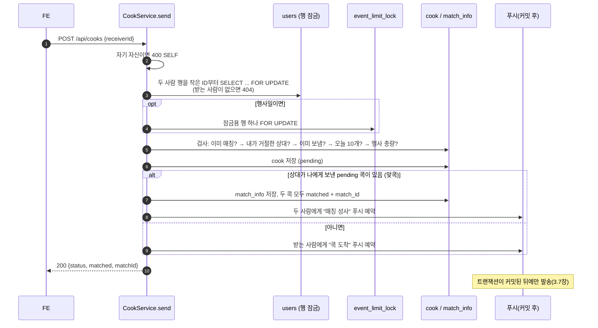

검사 순서는 정해져 있다. 같은 요청이라도 순서가 바뀌면 다른 오류 코드가 나가기 때문이다(`CookServiceTest`가 순서를 고정한다).

| 순서 | 검사 | 실패 시 |
| --- | --- | --- |
| 1 | 자기 자신 | 400 `SELF` |
| 2 | 받는 사람 존재 | 404 `NOT_FOUND` |
| 3 | 이미 매칭된 상대 | 409 `ALREADY_MATCHED` |
| 4 | 내가 이미 거절한 상대 | 409 `ALREADY_REJECTED` |
| 5 | 이미 보낸 콕 | 409 `DUPLICATE` |
| 6 | 오늘 10개 | 429 `DAILY_LIMIT` |
| 7 | 행사 전체 총량(행사일만) | 429 `EVENT_LIMIT` |

#### 동시에 요청이 오면: 잠금

콕은 "확인한 다음 저장"하는 구조라, 두 요청이 동시에 오면 둘 다 "아직 괜찮다"고 확인하고 둘 다 저장할 수 있다. 그래서 두 가지 잠금을 건다.

| 잠금 | 무엇을 막나 | 코드 |
| --- | --- | --- |
| 두 사람의 `users` 행 | 같은 두 사람에 대한 보내기·취소·거절이 겹칠 때, 나중 요청이 앞 요청의 결과를 보고 판정하게 한다 | `CookUserRepository.findAllByIdForUpdate` |
| `event_limit_lock`의 행 하나(행사일만) | 서로 다른 쌍이 총량 직전에 동시에 보내 둘 다 통과하는 것 | `EventLimitLock.acquire` |

- **`SELECT ... FOR UPDATE`**: 읽으면서 그 행에 잠금을 건다. 같은 행을 잠그려는 다른 트랜잭션은 앞 트랜잭션이 끝날 때까지 기다린다. JPA에서는 `@Lock(LockModeType.PESSIMISTIC_WRITE)`로 쓴다.
- **항상 작은 ID부터 잠근다**: A→B와 B→A가 서로 반대 순서로 잠그면 서로를 영원히 기다리는 교착이 생길 수 있다.
- **잠금 순서는 사용자 행 → 행사 잠금 → 나머지 조회**다. 순서를 바꾸면 잠금을 기다리는 동안 커밋된 다른 콕을 개수에서 못 볼 수 있다(자세한 이유는 `EventLimitLock.acquire` 주석).
- 행사일이 아니면 행사 잠금을 걸지 않는다. 그래서 **평소에 부하테스트를 하면 이 잠금의 비용이 측정되지 않는다** — 시계를 행사일로 맞춰야 한다.
- 이 규약은 `CookLockingIntegrationTest`(취소·거절·역방향 전송이 겹치는 순서별 결과), `EventWideLimitIntegrationTest`(총량 마지막 한 자리 경쟁)가 실제 MySQL로 확인한다.

#### 콕의 상태

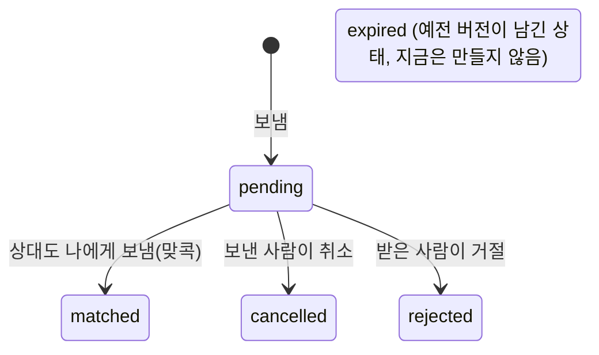

상태를 바꾸는 규칙은 서비스가 아니라 엔티티 메서드(`Cook.cancel`, `Cook.reject`, `Cook.match`)에 있다. `Cook`에는 setter가 없어서 상태를 바꾸는 모든 길이 이 검사를 거친다.

#### 핵심 규칙과 이유

| 규칙 | 어디 | 이유 |
| --- | --- | --- |
| 취소·거절돼도 오늘 사용 수는 돌아오지 않는다 | `CookService.countSent`(상태 조건 없이 셈) | 돌려주면 보냈다가 취소하는 식으로 하루 한도를 우회할 수 있다 |
| 같은 상대에게 한 번만 | `(sender_id, receiver_id)` unique + `DUPLICATE` 검사 | 검사와 저장 사이에 다른 요청이 끼어도 DB 제약이 막고, 그 예외도 409로 바꾼다 |
| 내가 거절한 상대에게는 내가 콕을 보낼 수 없다 | 검사 4번 | |
| 받은 목록에서 내가 거절한 콕은 빠지고, 보낸 사람 목록에는 `rejected`로 남는다 | `CookService.getCooks` | |
| 거절 API는 `COOK_REJECT_ENABLED`가 켜져 있고 `X-Cook-Reject-Contract: 1` 헤더가 있을 때만 동작, 아니면 404 | `CookController.reject` | 거절 기능 배포 전부터 열려 있던 이전 화면의 요청과 새 화면의 요청을 구분한다 |
| 하루는 한국 날짜 0시~다음 날 0시 | `EventTime`, `CookService.today` | 서버가 UTC라 그냥 날짜를 쓰면 오전 9시에 하루가 바뀐다 |

#### 관련 파일

| 파일 | 역할 |
| --- | --- |
| `cook/controller/CookController` | API 4개, 거절 기능 켜짐·헤더 확인 |
| `cook/service/CookService` | 보내기·맞콕·취소·거절·목록, 잠금 순서, 한도 |
| `cook/service/EventLimitLock` | 행사 총량 잠금 |
| `cook/entity/Cook`, `CookStatus`, `CookStatusConverter` | `cook` 테이블, 상태 변경 규칙 |
| `cook/repository/CookRepository` | 조회·개수 세기, 잠금 조회 |
| `cook/repository/CookUserRepository` | 두 사람 행 잠금 |
| `cook/config/CookProperties` | 거절 기능 켜짐 여부 |

#### 관련 테스트

`CookServiceTest`(검사 순서, 한도, 한국 자정 기준, 맞콕, 행사 잠금을 거는 시점), `CookTest`(상태 변경 규칙), `CookControllerTest`(거절 기능 꺼짐·헤더 없음이면 404), `CookLockingIntegrationTest`, `EventWideLimitIntegrationTest`(실제 MySQL 동시성).

---

### 3.4 매칭 (`match`)

#### 무슨 기능인가

성사된 매칭의 목록과 상세를 보여 주고, 채팅방을 어디까지 읽었는지 기록한다. **매칭을 만드는 API는 없다** — 맞콕 순간 `CookService`가 만든다(3.3장).

#### API

| API | 서비스 | 쓰는 화면(FE) |
| --- | --- | --- |
| `GET /api/matches` | `MatchService.getMatches` | 매칭 목록, 배지(5초마다) |
| `GET /api/matches/{matchId}` | `MatchService.getMatch` | 채팅방 상단 정보 |
| `PATCH /api/matches/{matchId}/read` | `MatchService.markRead` | 채팅방에 들어갈 때·나갈 때 |

#### 호출 흐름: 매칭 목록 (쿼리 수를 매칭 수와 무관하게)

매칭 하나마다 상대 프로필, 마지막 메시지, 안 읽은 개수가 필요하다. 매칭마다 따로 조회하면 매칭 10개에 쿼리가 30개 넘게 나간다. 그래서 세 가지를 **각각 한 번씩 모아서** 가져온다.

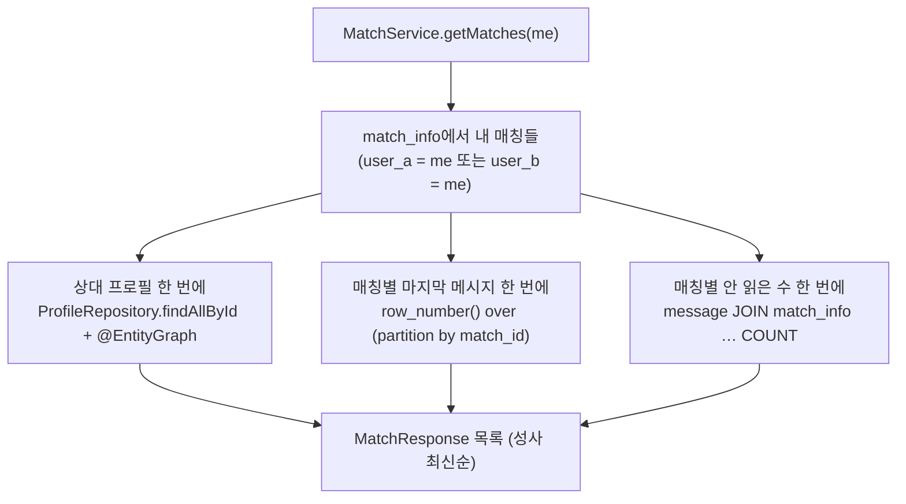

- 마지막 메시지와 안 읽은 수는 JPQL로 표현하기 어려워 **MySQL SQL을 직접**(`nativeQuery = true`) 쓰고, 결과는 getter만 있는 인터페이스(`RecentMessageProjection`, `UnreadCountProjection`)로 받는다.
- 이 배치 조회는 부하테스트에서 매칭 목록이 느린 원인으로 확인돼 바꾼 것이다(PR #67).

#### 핵심 규칙과 이유

| 규칙 | 어디 | 이유 |
| --- | --- | --- |
| 두 사람을 항상 (작은 ID → A, 큰 ID → B)로 저장 | `MatchInfo` 생성자 | 누가 먼저 보냈든 같은 쌍은 같은 모양. "A의 읽은 시각", "B의 읽은 시각" 컬럼이 따로 있다 |
| 당사자가 아니면 403 | `MatchInfo.includes` | 매칭·채팅·미션 권한 검사가 모두 이걸 쓴다 |
| 읽음 시각은 엔티티 저장이 아니라 **컬럼 하나만 바꾸는 UPDATE** | `MatchInfoRepository.markReadAsUserA/B` | 엔티티를 저장하면 행의 모든 컬럼을 덮어써서, 두 사람이 동시에 읽을 때 상대의 읽음 시각을 예전 값으로 되돌릴 수 있다 |
| 읽음 시각은 뒤로 가지 않는다 | 같은 UPDATE의 `WHERE last_read_at < :readAt` | 늦게 도착한 옛 요청이 시각을 되돌리면, 읽은 메시지가 다시 안 읽음으로 보인다 |
| 안 읽은 수 = 내가 마지막으로 읽은 뒤 **상대가** 보낸 메시지 수 | `MessageRepository.findUnreadCountsByMatchIds` | 내가 보낸 메시지는 세지 않는다 |

같은 `match_info` 테이블을 미션 쪽은 `MatchMission`이라는 다른 엔티티로 본다(3.6장). `MatchInfo`는 미션 컬럼을 모른다.

#### 관련 파일

`match/controller/MatchController`, `match/service/MatchService`, `match/entity/MatchInfo`, `match/repository/MatchInfoRepository`(+`RecentMessageProjection`), `match/dto/MatchResponse`, `RecentMessageResponse`, 그리고 안 읽은 수 쿼리가 있는 `chat/repository/MessageRepository`.

#### 관련 테스트

`MatchServiceTest`(조회를 매칭마다가 아니라 한 번씩 하는지, 읽음 처리가 자기 쪽 컬럼만 올리는지, 엔티티를 저장하지 않는지), `MatchReadStateIntegrationTest`(실제 MySQL에서 두 사람이 동시에 읽거나, 옛 요청이 늦게 커밋돼도 시각이 보존되는지), `MatchControllerTest`.

---

### 3.5 채팅 (`chat`)

#### 무슨 기능인가

매칭된 두 사람의 1:1 채팅. **보내기는 WebSocket(STOMP), 이력 조회는 REST**다. 운영시간(기본 09:00~18:00, 한국 시간)에만 보낼 수 있다.

#### 주소 한눈에

| 종류 | 주소 | 처리 |
| --- | --- | --- |
| 연결 | `/ws` (WebSocket) | `ChatHandshakeInterceptor`(쿠키 인증) → `ChatHandshakeHandler`(연결의 사용자 결정) |
| 보내기 | `SEND /app/chat/{matchId}/send` `{content, clientMessageId}` | `ChatMessageController.send` → `ChatService.send` |
| 받기(방 전체) | `SUBSCRIBE /topic/chat/{matchId}` | `ChatMessageSubscriber`가 Redis에서 받아 전달 |
| 받기(내 전송 확인) | `SUBSCRIBE /user/queue/chat-acks` | `send`의 반환값(`@SendToUser`) |
| 이력 | `GET /api/matches/{matchId}/messages?before=&limit=` | `ChatRestController` → `ChatService.getHistory` |

#### 호출 흐름: 메시지 하나가 상대 화면에 뜨기까지

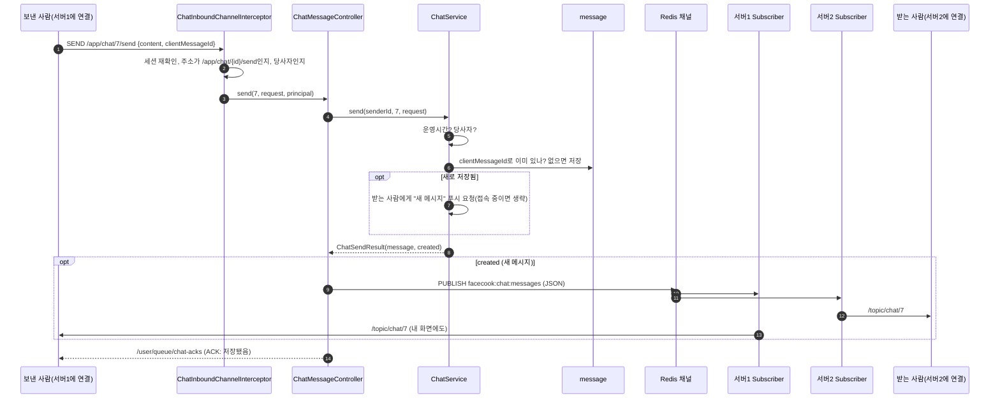

- **왜 Redis를 거치나**: 서버가 2대라 받는 사람은 다른 서버에 연결돼 있을 수 있다. 저장한 서버가 Redis 채널에 발행하면 두 서버가 모두 받아 각자 연결된 사람에게 보낸다.
- **ACK는 보낸 사람의 그 연결에만** 간다(`@SendToUser(..., broadcast = false)`). FE는 ACK를 받으면 "전송 중…"을 "보냄"으로 바꾸고, 10초 안에 안 오면 "전송 실패"로 표시한다.
- **발행이 실패해도 ACK는 간다**: 메시지는 이미 저장됐으므로 실시간 전달만 못 한 것이다. 발행 실패로 ERROR를 보내면 FE가 같은 메시지를 다시 보내게 되고, 그 재전송은 기존 메시지라 다시 발행되지 않는다(#84).

#### 같은 메시지가 두 번 저장되지 않게: `clientMessageId`

FE는 메시지를 보낼 때마다 UUID(`clientMessageId`)를 만들어 함께 보낸다. **다시 보낼 때도 같은 값을 쓴다.**

1. 먼저 `clientMessageId`로 찾아본다. 있으면 새로 저장하지 않고 그 메시지를 돌려준다(`created = false` → 발행·푸시 안 함).
2. 없으면 저장한다. 두 요청이 동시에 와서 둘 다 "없음"을 봤다면, DB의 unique 제약이 하나만 통과시키고 진 쪽은 방금 저장된 것을 다시 찾아 같은 결과를 돌려준다.
3. 찾은 메시지가 다른 사람·다른 방의 것이면 400 `VALIDATION`. UUID를 재사용해서 남의 메시지를 받아 보는 길이 되지 않게 한다.

이렇게 "같은 요청을 여러 번 보내도 결과가 한 번 보낸 것과 같은" 성질을 **멱등성**이라고 한다. 네트워크가 불안정한 휴대폰에서 재시도해도 메시지가 중복되지 않는다.

#### 놓친 메시지 채우기 (FE와 함께 동작)

Redis 발행은 방송이라, 그 순간 연결이 잠깐 끊겼던 사람은 메시지를 못 받는다. 서버는 저장까지만 보장하고, **FE가 이력 API로 대조해서 채운다**: 연결이 다시 붙을 때, 화면이 다시 보일 때, 채팅방이 열려 있는 동안 20초마다 최신 페이지부터 `before`로 이어 읽어 이미 가진 범위까지 다시 확인한다(facecook-fe#87).

#### 연결과 권한 확인

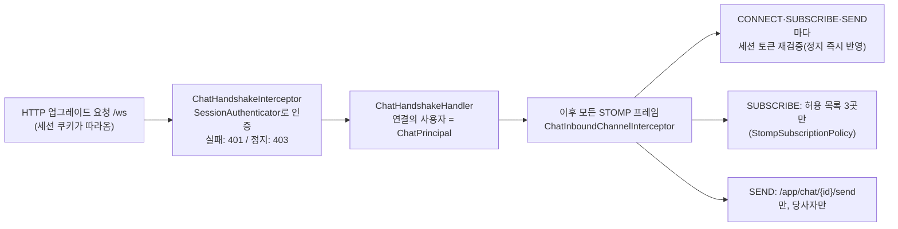

- 브라우저의 WebSocket은 헤더를 직접 붙일 수 없지만, 연결 주소에 해당하는 쿠키는 자동으로 실어 보낸다. 그래서 REST와 같은 세션 쿠키로 인증한다.
- 연결은 오래 유지되므로, 연결 뒤에 정지된 계정도 막으려고 **프레임마다 다시** 확인한다.
- `SEND /topic/chat/...`처럼 브로커 주소로 직접 보내면 저장·권한 검사를 건너뛸 수 있어서 막는다.
- STOMP 쪽 오류는 `ChatStompErrorHandler`가 REST와 같은 `{code, message}` 모양의 ERROR 프레임으로 만든다. `@MessageMapping` 안에서 난 예외는 이 핸들러를 거치지 않아서, `ChatMessageController.handleException`이 직접 ERROR 프레임을 만들어 보낸다.

#### 핵심 규칙과 이유

| 규칙 | 어디 | 이유 |
| --- | --- | --- |
| 운영시간 09:00 이상 18:00 미만(한국 시간)만 전송 | `ChatOperatingHoursProperties.contains`, `ChatService` | 시간은 환경변수 `CHAT_OPEN_TIME`·`CHAT_CLOSE_TIME`으로 바꾼다. 이력 조회는 언제든 된다 |
| 이력은 "몇 페이지"가 아니라 `before`(이 id보다 이전)로 넘김 | `ChatMessagePageReader` | 새 메시지가 계속 들어와도 페이지가 밀려서 겹치거나 빠지지 않는다 |
| 이력 조회와 권한 검사를 분리 | `ChatMessagePageReader`(조회만), `ChatService`·`SuperAccountService`(검사) | 참가자는 당사자만, 슈퍼 계정은 모든 방 — 검사 규칙이 달라서 조회만 공유한다 |
| 메시지 1,000자, 내용 필수 | `SendChatMessageRequest` | |

#### 관련 파일

| 파일 | 역할 |
| --- | --- |
| `chat/controller/ChatMessageController` | STOMP 전송, ACK, STOMP 예외 → ERROR 프레임 |
| `chat/controller/ChatRestController` | 이력 REST |
| `chat/service/ChatService` | 전송(운영시간·당사자·멱등 저장·푸시), 이력 |
| `chat/service/ChatMessagePageReader` | 이력 한 페이지 조회(참가자·슈퍼 공용) |
| `chat/service/ChatAuthorizationService` | 당사자 확인 |
| `chat/redis/ChatMessagePublisher`, `ChatMessageSubscriber`, `ChatRedisChannels` | 서버 간 중계 |
| `chat/redis/ChatPresenceService`, `ChatWebSocketEventListener` | 접속 기록(4장) |
| `chat/websocket/*` | 연결 인증, 사용자(`ChatPrincipal`), 프레임 검문, ERROR 프레임 |
| `config/WebSocketConfig`, `config/RedisChatConfig`, `common/websocket/StompSubscriptionPolicy` | 설정, 구독 허용 목록 |

#### 관련 테스트

`ChatServiceTest`(재전송이면 기존 메시지, 동시 저장 수렴, 다른 방 UUID 재사용 차단, 운영시간 경계), `ChatMessageControllerTest`(ACK와 발행, 발행 실패에도 ACK, ERROR 프레임), `ChatInboundChannelInterceptorTest`, `ChatHandshakeInterceptorTest`, `StompSubscriptionPolicyTest`, `ChatRestControllerTest`, `ChatOperatingHoursPropertiesTest`, `ChatPresenceServiceRedisIntegrationTest`(4장).

---

### 3.6 미션 (`mission`)

#### 무슨 기능인가

매칭된 두 사람이 부스에서 함께 하는 3단계 과제다. 매칭마다 미션 **묶음** 하나(STEP 1~3 세트)가 무작위로 배정되고, 참가자는 지금 STEP의 문구만 본다. 과제를 했는지는 **운영진(관리자)이 부스에서 직접 확인하고** 완료 처리한다 — 참가자가 스스로 "완료"를 누르는 API는 없다. 완료되면 참가자 화면이 실시간으로 다음 STEP으로 바뀐다.

#### API

| API | 서비스 | 누가 |
| --- | --- | --- |
| `GET /api/matches/{matchId}/mission` | `MissionService.getProgressAndAssignIfMissing` | 매칭 당사자 |
| `GET /api/admin/missions[?includeExcluded=true]` | `MissionService.getAllProgress` / `getAllProgressWithExclusions` | 관리자 |
| `POST /api/admin/missions/{matchId}/complete` `{expectedStep}` | `MissionService.completeCurrentStep` | 관리자 |
| `SUBSCRIBE /topic/mission/{matchId}` (WebSocket) | `MissionEventSubscriber`가 전달 | 매칭 당사자 |

#### 테이블 두 개, 엔티티 셋

| 엔티티 | 테이블 | 뜻 |
| --- | --- | --- |
| `MatchMission` | `match_info` | 매칭의 미션 진행(현재 STEP, STEP별 완료 시각·처리자). **매칭의 `MatchInfo`와 같은 행**을 미션 컬럼만 보는 엔티티다 |
| `MatchMissionAssignment` | `match_mission_assignment` | 매칭에 배정된 STEP별 미션(매칭당 3행) |
| `MissionTemplate` | `mission_template` | 미션 문구 원본. 묶음(bundle) 단위, V6 마이그레이션이 넣은 고정 데이터 |

`MatchInfo`는 읽음 시각을, `MatchMission`은 진행 단계를 다루고 서로의 컬럼은 매핑하지 않는다. 엔티티가 둘이라 "당사자인가" 검사도 `ChatAuthorizationService`(→`MatchInfo`)와 `MissionAuthorizationService`(→`MatchMission`)에 똑같은 모양으로 따로 있다.

#### 호출 흐름 ① 참가자가 미션을 처음 볼 때: 필요할 때 한 번만 배정

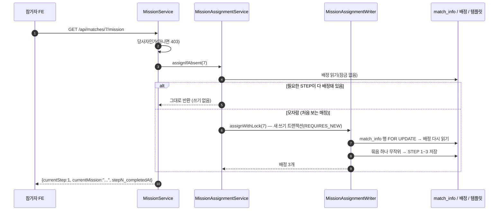

- **읽기 먼저, 필요할 때만 잠금**: 대부분의 조회는 이미 배정된 매칭이라 잠금 없이 끝난다. 처음 보는 매칭만 잠그고 다시 확인한 뒤 채운다. 두 사람이 동시에 처음 열어도 먼저 잠근 쪽이 채우고, 나중 쪽은 잠금을 기다렸다가 이미 채워진 것을 본다(`MissionBundleAssignmentIntegrationTest`).
- **`REQUIRES_NEW`**: 조회 메서드는 읽기 전용 트랜잭션인데 배정은 써야 한다. 그래서 배정만 **새 쓰기 트랜잭션**을 따로 열어 처리하고 커밋한다.
- 세 STEP은 항상 **같은 묶음**에서 나온다. 예전엔 STEP별로 따로 뽑아 서로 어울리지 않는 조합이 나왔다(V6에서 묶음 방식으로 바꿈).

#### 호출 흐름 ② 관리자가 완료 처리할 때

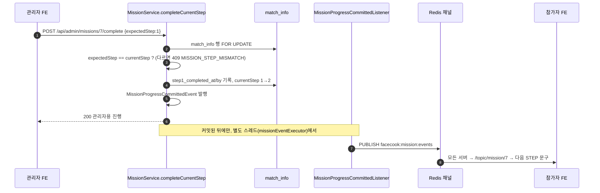

- **`expectedStep`**: 관리자가 확인 화면에서 **본** STEP을 그대로 보낸다. 서버의 현재 STEP과 다르면 409. 두 운영진이 같은 매칭을 동시에 누르거나, 네트워크 재시도로 요청이 두 번 가도 한 번만 처리된다(`MissionCompletionConcurrencyIntegrationTest`). "지금 STEP을 완료해 줘"로 받으면, 재시도가 다음 STEP까지 완료해 버린다.
- **이벤트로 나눈 이유**: 실시간 알림은 커밋된 뒤에만 보내야 한다(롤백된 진행을 화면에 보여 주면 안 된다). `@TransactionalEventListener(AFTER_COMMIT)`이 그걸 보장하고, `@Async`로 관리자 응답이 Redis를 기다리지 않게 한다. 알림 발행이 실패해도 완료는 이미 커밋됐고, 참가자는 REST 재조회로 최신 상태를 본다.

#### 핵심 규칙과 이유

| 규칙 | 어디 | 이유 |
| --- | --- | --- |
| 참가자는 현재 STEP 문구만 받는다 | `MissionProgressResponse` | 다음 과제를 미리 알 수 없게 |
| `currentStep` 4 = 모두 완료 | `MatchMission.COMPLETED_STEP` | `LAST_STEP = COMPLETED_STEP - 1`로 정의해 STEP 수를 한 곳에서 바꾼다 |
| 관리자 목록은 매칭 하나가 배정에 실패해도 나머지는 보여 준다 | `MissionService.collectAllProgress` | 실패한 매칭은 `excluded`(`NO_TEMPLATE`/`UNKNOWN`)로 따로 알려 준다(`?includeExcluded=true`일 때). 파라미터 없으면 예전 FE와 같은 배열 |
| 관리자 권한은 컨트롤러가 확인 | `AdminMissionController` → `AdminAuthorization.requireAdmin` | `MissionService`는 호출자가 관리자라고 전제한다 |

#### 관련 파일

`mission/controller/MissionController`, `AdminMissionController`, `mission/service/MissionService`, `MissionAssignmentService`, `MissionAssignmentWriter`, `MissionAuthorizationService`, `MissionTemplateNotFoundException`, `mission/entity/*`, `mission/repository/*`, `mission/event/*`, `mission/redis/*`, `mission/config/MissionRedisConfig`.

#### 관련 테스트

`MissionServiceTest`, `MatchMissionTest`(expectedStep 규칙), `MissionAssignmentServiceTest`·`MissionAssignmentWriterTest`(언제 잠그고 무엇을 채우는지, 같은 묶음 재사용), `MissionBundleAssignmentIntegrationTest`(V6 데이터 모양, 동시 첫 배정도 묶음 하나), `MissionCompletionConcurrencyIntegrationTest`(동시 완료 요청 중 하나만 성공), `MissionProgressCommittedIntegrationTest`(커밋 후에만 Redis 발행), `MissionEventSubscriberTest`, `MissionRedisConfigTest`.

---

### 3.7 푸시 (`push`)

#### 무슨 기능인가

앱을 닫아 둔 참가자에게 **콕 도착, 매칭 성사, 새 메시지**를 브라우저 알림으로 알려 준다. 발송 API는 없다 — 해당 일이 생길 때 서버가 스스로 보낸다. 앱을 켜 둔 사람(WebSocket 연결 중)에게는 보내지 않는다.

#### 구독(알림 켜기)

| API | 서비스 |
| --- | --- |
| `GET /api/push/vapid-public-key` | `PushSubscriptionService.getVapidPublicKey` |
| `POST /api/push/subscribe` `{endpoint, keys:{p256dh, auth}}` | `PushSubscriptionService.subscribe` |
| `DELETE /api/push/subscribe` | `PushSubscriptionService.unsubscribe` |

1. FE가 서버의 **VAPID 공개키**를 받는다.
2. 브라우저에 구독을 만든다(`pushManager.subscribe`). 브라우저가 "이 기기로 보낼 주소(`endpoint`)와 암호화 키"를 준다.
3. 그 값을 서버에 등록한다. 같은 브라우저를 다시 등록하면 새 행 대신 키만 갱신한다(`(user_id, endpoint)` unique). 두 요청이 동시에 와서 한쪽이 unique 제약에 막히면, 진 쪽은 다시 찾아 갱신으로 이어간다(`PushSubscriptionConcurrencyIntegrationTest`).

- **VAPID**: 서버가 비밀키로 푸시 요청에 서명하고, 푸시 서버(구글 FCM, 애플 등)는 구독 때 받은 공개키로 "그 구독을 만든 서버가 보낸 것"인지 확인한다.

#### 발송 흐름

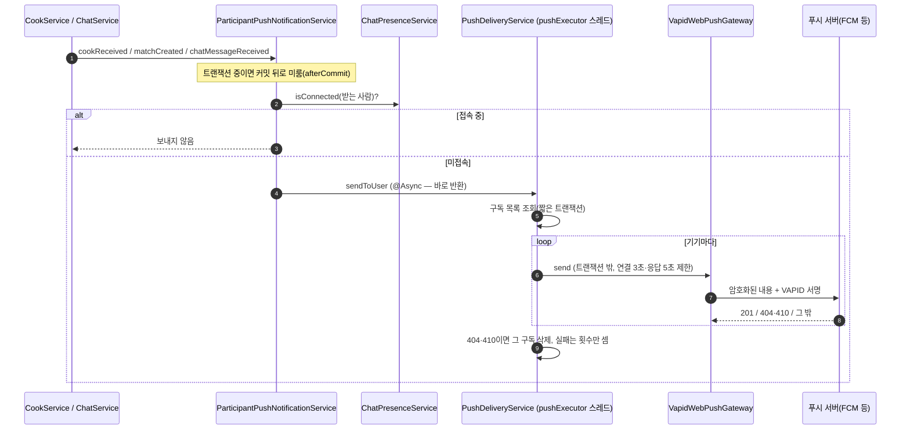

- **커밋 뒤에만**: 콕 저장이 롤백됐는데 "콕이 왔어요" 알림이 가면 안 된다. `ParticipantPushNotificationService.sendAfterCommit`이 트랜잭션이 있으면 `afterCommit`으로 미룬다.
- **요청 스레드를 막지 않는다**: 푸시 서버 왕복은 느릴 수 있어서 `@Async("pushExecutor")`로 전용 스레드에 맡기고 바로 돌아온다. 콕 보내기 응답이 푸시를 기다리지 않는다(#82).
- **외부 호출 동안 DB 커넥션을 쥐지 않는다**: 구독 조회·삭제는 각각 짧은 트랜잭션, HTTP 호출은 트랜잭션 밖이다(#82).
- **제한 시간**: 푸시 서버가 응답하지 않아도 8초 안에 포기한다. 없으면 스레드 8개가 모두 묶여 알림이 쌓이다 버려진다(#113).
- **best-effort**: 푸시가 실패해도 콕·매칭·메시지 처리는 이미 성공이다. 실패는 로그로 남기고, 실행기 대기열이 가득 차 거절된 것과 발송 실패 횟수는 `PushDeliveryMonitor`가 30초마다 한 줄로 남긴다(문제가 있을 때만).

| 종류 | 언제 | 알림을 누르면 |
| --- | --- | --- |
| `COOK_RECEIVED` | 맞콕이 아닌 콕을 받음 | `/main` |
| `MATCH_CREATED` | 맞콕으로 매칭 성사(두 사람 모두) | `/match/{matchId}/matched` |
| `CHAT_MESSAGE_RECEIVED` | 새 메시지(재전송은 제외) | `/match/{matchId}` |

FE 서비스 워커(`public/push-sw.js`)가 `title`·`body`로 알림을 띄우고, 누르면 `url`로 이동한다.

#### 관련 파일

| 파일 | 역할 |
| --- | --- |
| `push/service/ParticipantPushNotificationService` | 알림 3종의 진입점: 커밋 후, 접속 중이면 생략 |
| `push/service/PushDeliveryService` | 구독별 발송(비동기), 만료 구독 삭제 |
| `push/service/VapidWebPushGateway` (`WebPushGateway`) | 암호화·서명·HTTP 전송, 제한 시간 |
| `push/service/PushDeliveryMonitor` | 거절·실패 집계 로그 |
| `push/service/PushSubscriptionService`, `push/controller/PushSubscriptionController` | 구독 등록·해지 |
| `push/entity/PushSubscription`, `push/repository/*` | `push_subscription` |
| `config/AsyncConfig` (`pushExecutor`) | 전용 스레드 풀 |

#### 관련 테스트

`ParticipantPushNotificationServiceTest`(접속 중 생략, 커밋 후 발송, 실행기 거절 흡수), `PushDeliveryServiceTest`(만료 구독 삭제, 실패·제한 시간은 구독 유지), `PushDeliveryServiceAsyncIntegrationTest`(호출이 느린 발송을 기다리지 않음, 대기열 포화 시 거절), `VapidWebPushGatewayTest`(서명·암호화, 응답 없는 서버에서 제한 시간 안에 포기), `PushDeliveryMonitorTest`, `PushSubscriptionServiceTest`, `PushSubscriptionConcurrencyIntegrationTest`, `PushSubscriptionControllerTest`.

---

### 3.8 신고 (`report`)

#### 무슨 기능인가

참가자가 불쾌한 상대를 신고하면, 관리자가 목록에서 보고 두 사람의 채팅을 확인한 뒤 **처리 완료**한다. 처리할 때 **계정 정지**를 같이 고를 수 있다. 정지된 계정은 그 뒤 모든 API와 채팅이 막힌다.

#### API

| API | 누가 | 서비스 |
| --- | --- | --- |
| `POST /api/reports` `{reportedUserId, reason, detail?}` | 로그인한 누구나 | `ReportService.create` |
| `GET /api/admin/reports` | 관리자 | `ReportService.getAll` (최신 접수순, 페이지 없음) |
| `GET /api/admin/reports/{reportId}` | 관리자 | `ReportService.get` |
| `GET /api/admin/reports/{reportId}/chat` | 관리자 | `ReportService.getChat` |
| `POST /api/admin/reports/{reportId}/resolve` `{suspend}` | 관리자 | `ReportService.resolve` |

- 신고자는 요청 본문이 아니라 세션(`@CurrentUser`)에서 온다. 다른 사람 이름으로 신고할 수 없다.
- 관리자 API는 컨트롤러 첫 줄의 `AdminAuthorization.requireAdmin`이 역할을 본다. 역할이 `ADMIN`인지만 보므로 **슈퍼 계정도 403**이다.

#### 흐름: 접수 → 처리(+ 정지)

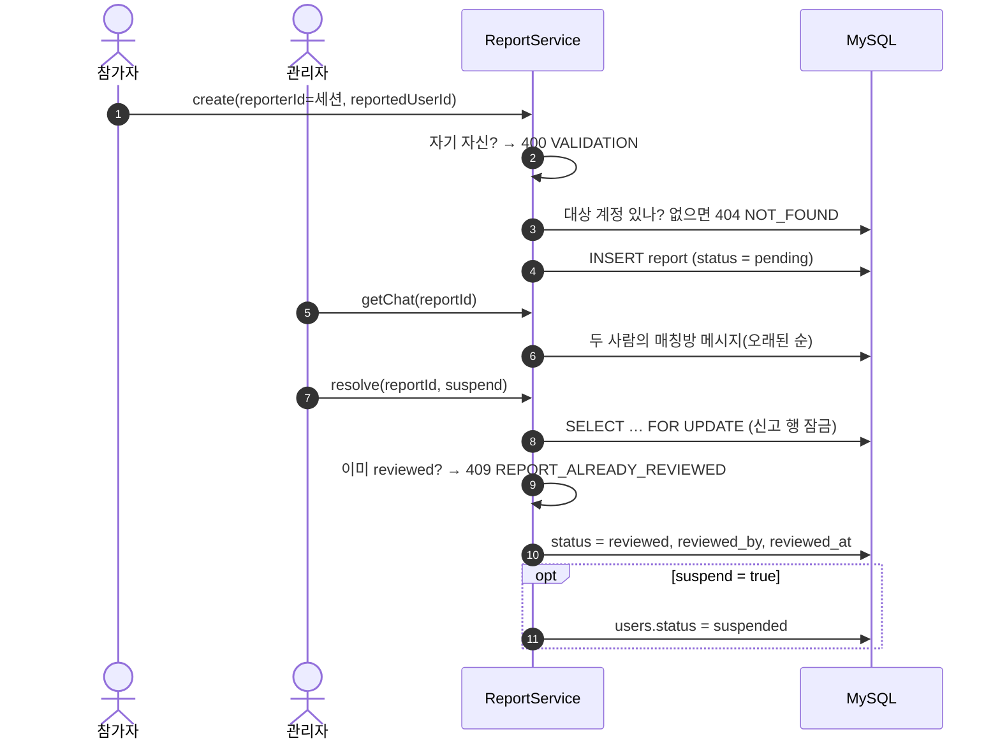

#### 핵심 규칙과 이유

- **처리는 한 번만**: 상태는 `pending → reviewed` 한 방향이다. 두 관리자가 같은 신고를 동시에 처리하면, 신고 행 잠금(`findByIdForUpdate`) 때문에 한쪽이 기다렸다가 `reviewed`를 보고 409를 받는다(`Report.review`).
- **`suspend`는 반드시 보낸다**: `Boolean` + `@NotNull`이라 빠뜨리면 400이다. 원시형 `boolean`이었다면 빠뜨린 값이 `false`로 들어와 "정지 안 함"으로 처리됐을 것이다(`ReportControllerTest#resolveRequiresSuspendDecision`).
- **정지는 신고 처리에서만 한다**: `User.suspend()`를 부르는 곳은 `ReportService.resolve` 하나다. 정지를 푸는 API는 없다.
- **정지의 효과**: 모든 인증이 `SessionAuthenticator`에서 매번 DB의 계정 상태를 읽는다. 그래서 정지된 사람은 **다음 요청부터** 막힌다 — HTTP는 403 `SUSPENDED`와 함께 쿠키가 지워지고, 채팅은 다음 CONNECT·SUBSCRIBE·SEND 프레임에서 오류 프레임을 받는다(3.5장). 로그인도 `SUSPENDED`로 거절된다.
- **채팅 이력**: 신고 행에는 매칭 ID가 없다. 그래서 `findChatMessages`가 `match_info`에서 두 사람을 A·B 양쪽 조합으로 찾아 메시지를 모은다(네이티브 SQL). 매칭된 적 없으면 빈 목록이다.
- **상태 문자열은 소문자**: DB 값(`pending`/`reviewed`)과 응답 모두 소문자다. `ReportStatusConverter`가 enum ↔ 소문자를 바꾼다. `toLowerCase(Locale.ROOT)`는 서버 로케일(예: 터키어)에 따라 `I`가 다른 글자로 바뀌지 않게 한다(`ReportResponseTest`).

#### 새로 나오는 Spring·JPA 기능

| 기능 | 뜻 | 이 코드에서 |
| --- | --- | --- |
| `@Convert` + `AttributeConverter` | 필드 값을 DB에 넣고 꺼낼 때 변환 규칙을 직접 정함 | enum `PENDING` ↔ 문자열 `pending` |
| `@Lock(PESSIMISTIC_WRITE)` | 조회 쿼리에 `FOR UPDATE`를 붙임 | 신고 처리 중복 방지 |
| `@Query(nativeQuery = true)` | JPQL 대신 SQL을 그대로 씀 | 채팅 이력 조회 |
| 인터페이스 프로젝션 | getter만 있는 인터페이스를 결과 타입으로 두면, 열 별칭과 같은 이름의 getter에 값을 채운 객체를 Spring Data가 만들어 줌 | `ReportChatMessageProjection` (`as messageId` → `getMessageId()`) |

#### 관련 파일

| 파일 | 역할 |
| --- | --- |
| `report/controller/ReportController` | 참가자 신고 접수 |
| `report/controller/AdminReportController` | 관리자 목록·상세·채팅·처리 |
| `report/service/ReportService` | 검증, 저장, 처리(+ 정지), 채팅 이력 |
| `report/entity/Report`, `ReportStatus`, `ReportStatusConverter` | `report` 테이블, 상태 전이 |
| `report/repository/ReportRepository`, `ReportChatMessageProjection` | 잠금 조회, 채팅 이력 네이티브 쿼리 |
| `auth/entity/User#suspend`, `common/session/SessionAuthenticator` | 정지와 그 효과 |

#### 관련 테스트

`ReportServiceTest`(접수, 자기 신고·없는 대상 거절, 정지 없이/정지와 함께 처리, 이미 처리된 신고 거절, 채팅 이력, 없는 신고), `ReportControllerTest`(참가자 접수, 사유 누락, 관리자 조회·처리, 참가자의 관리자 API 거절, `suspend` 누락), `ReportResponseTest`(로케일과 무관한 소문자).

---

### 3.9 관리자·슈퍼 계정 (`admin`, `superaccount`)

역할이 셋이다(`UserRole`). 관리자와 슈퍼는 **서로의 API를 쓸 수 없다** — 검사가 "이 역할인가"만 보고 위아래 관계가 없다.

| 역할 | 할 수 있는 것 | 계정이 생기는 방법 |
| --- | --- | --- |
| 참가자 `PARTICIPANT` | 프로필·콕·채팅·미션 보기·신고 | 이메일 인증 가입(3.1장) |
| 관리자 `ADMIN` | 미션 완료(3.6), 신고 처리(3.8), 통계 | 코드에 만드는 경로가 없다. 실습에서는 DB에 직접 넣는다(8.5장) |
| 슈퍼 `SUPER` | 전체 계정·채팅방·메시지 열람(읽기만) | 서버 기동 때 `SuperAccountBootstrap`이 환경변수로 만든다 |

#### 관리자 통계: `GET /api/admin/stats`

`AdminStatsService.getStats`가 개수 여섯 개를 각각 세서 한 응답으로 묶는다. 한 번에 세는 것이 아니라서 값 사이에 아주 짧은 시차가 있을 수 있다.

| 필드 | 세는 것 |
| --- | --- |
| `totalUsers` | `users` 전체 — **관리자·슈퍼 계정 포함** |
| `activeToday` | 설정에 따라 다름(아래) |
| `totalCooks` | `cook` 전체(상태 무관) |
| `totalMatches` | `match_info` 전체 |
| `missionCleared` | 세 STEP을 모두 끝낸 매칭(`current_step >= 4`) |
| `pendingReports` | 처리 전 신고 |

`activeToday`는 `ADMIN_STATS_ACTIVE_USER_CRITERION`(`app.admin.stats.active-user-criterion`)에 따라 센다.

- `LAST_ACTIVE_TODAY`(기본값): `last_active_at`이 오늘(행사 시간대 자정부터)인 계정 수. `last_active_at`은 로그인한 요청마다 `ActivityTrackingInterceptor`가 30초 간격으로 갱신한다. 관리자·슈퍼 계정도 오늘 요청을 보냈으면 들어가고, 오늘 활동한 뒤 정지된 계정도 들어간다.
- `STATUS`: `status = active`인 계정 수. 활동 시각을 보지 않아서 사실상 **정지되지 않은 전체 계정**이다(#121 전의 기본값).

참가자 메인 화면의 "활동 중"(`GET /api/stats`)은 또 다르다 — 최근 15분(기본값) 안에 활동한, **프로필이 있는** 계정 수다(`ProfileActivityLookup.activeSince`). 세 숫자는 세는 대상이 달라서 서로 맞지 않아도 정상이다.

#### 슈퍼 계정

- **만들기**: `SuperAccountBootstrap`은 `ApplicationRunner`라서 기동이 끝난 직후(로그 `Started FacecookBeApplication` 다음) 한 번 실행된다. `SUPER_ACCOUNT_LOGIN`·`SUPER_ACCOUNT_PASSWORD`가 비었으면 아무것도 안 한다. 그 아이디의 계정이 없으면 만들고, 있으면 비밀번호가 다를 때만 바꾼다. 같은 아이디를 **다른 역할의 계정이 쓰고 있으면 건드리지 않고** 오류 로그만 남긴다(`SuperAccountBootstrapTest`).
- **서버 두 대가 동시에 뜰 때**: 둘 다 "없음"을 보고 만들려 하면 `users.email` unique 때문에 한쪽이 실패한다. 다른 쪽이 이미 만들었으니 그 예외는 무시한다.
- **로그인**: 참가자와 같은 비밀번호 로그인(`POST /api/auth/login`)을 쓴다(8.2장).

| API | 서비스 | 내용 |
| --- | --- | --- |
| `GET /api/super/users` | `SuperAccountService.listUsers` | 전체 계정 + 프로필(없으면 null) |
| `GET /api/super/chats` | `SuperAccountService.listChats` | 전체 매칭방(최신 성사순) + 두 사람 + 마지막 메시지 |
| `GET /api/super/chats/{matchId}/messages?before=&limit=` | `SuperAccountService.listMessages` | 방 하나의 메시지, 최신부터 `limit`개(1~100, 기본 50) |

- **당사자 확인이 없다**: 참가자용 채팅 이력(`ChatService.getHistory`)은 당사자만 볼 수 있지만, 슈퍼 API는 역할만 확인하고 모든 방을 연다. 메시지를 페이지로 읽는 부분은 두 쪽이 `ChatMessagePageReader`를 같이 쓴다.
- **목록을 몇 번의 쿼리로**: `listChats`는 매칭 전체 1번, 두 사람의 계정 1번, 프로필 1번, 방마다 마지막 메시지 1번(`findLatestPerMatch` — 방별 가장 큰 메시지 id)으로 모은 뒤 `Map`으로 짝을 맞춘다. 방이 늘어도 쿼리 수는 4번이다.
- **`@Validated`**: 요청 본문이 아닌 `@RequestParam`에 붙은 `@Min`·`@Max`·`@Positive`는 클래스에 `@Validated`가 있어야 검사된다. 어기면 `ConstraintViolationException` → `GlobalExceptionHandler`가 400 `VALIDATION`으로 바꾼다.

#### 관련 파일

| 파일 | 역할 |
| --- | --- |
| `admin/controller/AdminStatsController`, `admin/service/AdminStatsService` | 통계 |
| `admin/config/AdminStatsProperties`, `ActiveUserCriterion`, `AdminConfig` | `activeToday` 기준 설정 |
| `superaccount/bootstrap/SuperAccountBootstrap` | 기동 시 슈퍼 계정 생성·비밀번호 갱신 |
| `superaccount/config/SuperAccountProperties`, `SuperAccountConfig` | 아이디·비밀번호 설정 |
| `superaccount/controller/SuperAccountController`, `superaccount/service/SuperAccountService` | 전체 열람 |
| `common/session/AdminAuthorization`, `SuperAuthorization` | 역할 검사 한 줄 |

#### 관련 테스트

`AdminStatsPropertiesTest`(application.yml과 `@DefaultValue`의 기본값이 `LAST_ACTIVE_TODAY`, `STATUS` 선택 가능), `AdminStatsServiceTest`(`STATUS` 기준, `LAST_ACTIVE_TODAY` 기준), `AdminStatsControllerTest`(관리자 조회, 참가자 거절), `SuperAccountBootstrapTest`(빈 설정, 생성, 비밀번호 갱신·유지, 다른 역할 계정 보호), `SuperAccountControllerTest`(계정·채팅방·메시지 열람, 관리자·참가자 거절).

---

## 4. 실시간·비동기

요청-응답(REST) 밖에서 도는 것들을 모았다. 
### 4.1 WebSocket과 STOMP 기본

- **WebSocket**: 브라우저와 서버가 연결을 열어 두고 양쪽에서 아무 때나 메시지를 보낼 수 있는 통신. 5초마다 묻는 폴링과 달리 서버가 먼저 보낼 수 있다.
- **STOMP**: WebSocket 위에서 "어느 주소로 보낸다(SEND)", "어느 주소를 받아 보겠다(SUBSCRIBE)"를 표현하는 약속. 스프링이 기본으로 지원한다.
- **브로커**: 구독 목록을 들고 있다가 주소로 온 메시지를 구독자들에게 나눠 주는 역할. 이 프로젝트는 서버 안에 내장된 단순 브로커(`enableSimpleBroker`)를 쓴다. 그래서 **각 서버의 브로커는 자기에게 연결된 사람만 안다** — 서버 간 전달을 Redis가 맡는 이유다.
- **하트비트**: 서버와 FE가 10초마다 신호를 주고받는다. 휴대폰 네트워크가 바뀌며 조용히 끊긴 연결을 서버가 알아채고 닫는다(`WebSocketConfig.STOMP_HEARTBEAT_MS`).

| 접두사 | 뜻 | 예 |
| --- | --- | --- |
| `/app` | 서버 코드(`@MessageMapping`)로 가는 주소 | `/app/chat/7/send` |
| `/topic` | 여러 사람이 구독하는 방송 주소 | `/topic/chat/7`, `/topic/mission/7` |
| `/user/queue` | 나에게만 오는 주소. 스프링이 연결별 큐로 바꿔 준다 | `/user/queue/chat-acks` |

### 4.2 Redis Pub/Sub: 서버 2대 사이의 전달

`ChatMessagePublisher`가 채널 `facecook:chat:messages`에 발행하면, 서버가 켜질 때 구독해 둔(`RedisChatConfig`) 모든 서버의 `ChatMessageSubscriber`가 받는다. Pub/Sub은 **저장하지 않는 방송**이라 그 순간 받을 서버가 없으면 사라진다. 그래서 메시지는 항상 DB에 먼저 저장하고, 실시간 전달은 "최선을 다하는" 보조 수단으로 둔다.

### 4.3 접속 기록(presence): 푸시를 보낼지 판단

앱을 켜 두고 있는 사람에게는 푸시를 보내지 않는다. 그 판단 근거가 Redis의 접속 기록이다(`ChatPresenceService`).

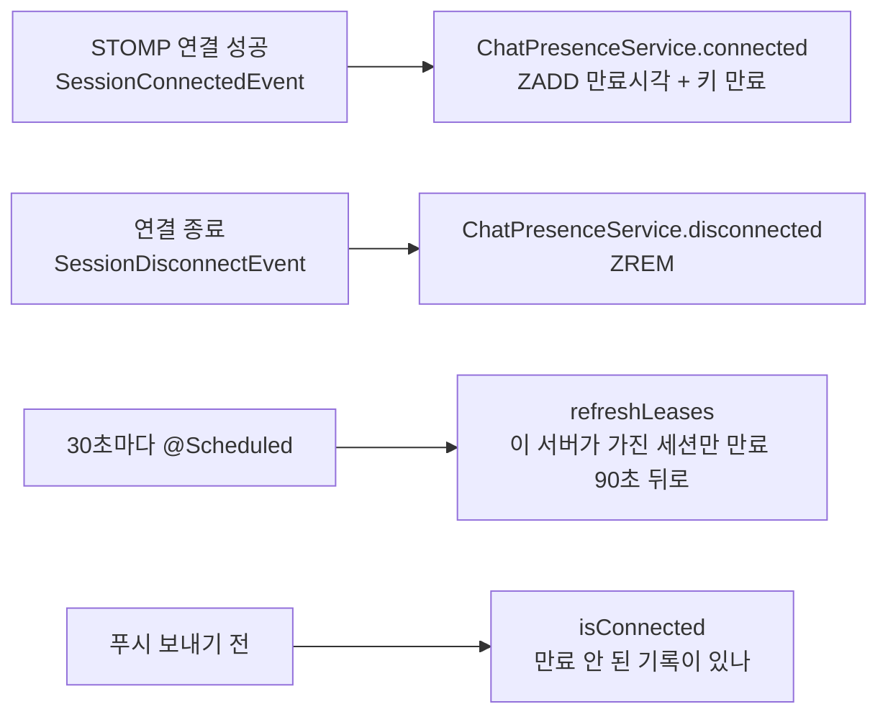

- 사용자마다 Redis Sorted Set 하나(`facecook:chat:presence:v2:{userId}`)에, 연결(`서버 인스턴스 ID:세션 ID`)마다 **만료 시각**을 점수로 둔다. 만료 안 된 게 하나라도 있으면 접속 중이다.
- **왜 만료가 필요한가**: 서버가 죽거나 배포로 강제 종료되면 연결 종료 이벤트가 오지 않는다. 예전엔 기록이 영구히 남아, 배포 순간 접속해 있던 사람이 그 뒤로 푸시를 전혀 못 받았다(#81). 이제는 세션을 가진 서버가 30초마다 연장하고, 서버가 사라지면 연장이 멈춰 최대 90초 뒤 빠진다.
- 쓰기와 만료 설정은 Lua 스크립트 하나로 원자적으로 한다. 두 명령으로 나누면 중간에 서버가 죽었을 때 만료 없는 키가 남는다.
- 배포는 기존 컨테이너를 정상 종료(`docker stop -t 30`)하고, 스프링은 `server.shutdown: graceful`로 연결을 닫으며 해제 이벤트를 낸다.

### 4.4 커밋 뒤에 실행하기: 두 가지 방법

"DB에 확정된 뒤에만 해야 하는 일"이 여러 곳에 있다. 이 코드는 두 가지 방법을 쓴다.

| 방법 | 쓰는 곳 | 모양 |
| --- | --- | --- |
| `TransactionSynchronizationManager.registerSynchronization(... afterCommit ...)` | 인증코드 소비(`AuthService`), 푸시(`ParticipantPushNotificationService`) | 메서드 안에서 "커밋되면 이걸 실행해 줘"를 직접 등록 |
| `ApplicationEventPublisher.publishEvent` + `@TransactionalEventListener(phase = AFTER_COMMIT)` | 미션 진행 알림(`MissionService` → `MissionProgressCommittedListener`) | 이벤트를 발행하고, 받는 쪽이 커밋 뒤에 실행 |

둘 다 트랜잭션이 롤백되면 실행되지 않는다. 트랜잭션이 없는 상태에서 부르면 첫 번째 방식 코드는 바로 실행하도록 직접 분기해 두었다(`consumeCodeAfterCommit`, `sendAfterCommit`).

### 4.5 비동기 실행기 (`@Async`)

| 실행기 | 스레드 | 대기열 | 쓰는 곳 | 가득 차면 |
| --- | --- | --- | --- | --- |
| `pushExecutor` | 4~8 | 200 | `PushDeliveryService.sendToUser` | 거절 → 호출부가 흡수하고 횟수만 셈(푸시 유실) |
| `missionEventExecutor` | 2~4 | 100 | `MissionProgressCommittedListener` | 거절 — 완료는 이미 커밋돼 있고 실시간 알림만 빠진다(참가자는 재조회로 본다) |

- 실행기를 나눈 이유: 느린 푸시 서버 때문에 미션 알림까지 밀리지 않게 하기 위해서다.
- 스레드 풀 동작: 기본 스레드(4)가 다 바쁘면 대기열(200)에 쌓고, 대기열까지 차면 최대 스레드(8)까지 늘리고, 그래도 넘치면 거절한다.
- 서버 종료 때는 진행 중인 작업을 잠깐 기다린다(`waitForTasksToCompleteOnShutdown`, 푸시 10초·미션 5초).
- **주의**: `@Async`는 다른 빈에서 부를 때만 적용된다. 같은 클래스 안에서 `this.method()`로 부르면 그냥 동기로 돈다.

### 4.6 주기 작업 (`@Scheduled`)

`SchedulingConfig`의 `@EnableScheduling`이 켠다. **서버마다 각자** 돈다.

| 작업 | 주기 | 하는 일 |
| --- | --- | --- |
| `ChatPresenceService.refreshLeases` | 30초 | 이 서버가 가진 WebSocket 세션의 접속 기록 만료를 90초 뒤로 연장 |
| `PushDeliveryMonitor.report` | 30초 | 푸시 거절·실패 횟수, 실행기 상태를 로그로(문제가 있을 때만) |
| `DbConnectionPoolMonitor.sample` / `report` | 1초 / 30초 | DB 연결 풀의 사용 중·대기 수 최댓값을 모아, 연결을 기다린 요청이 있었던 구간만 로그로(#127) |

서버 기동 직후 한 번 실행되는 작업도 있다: 예전 형식 접속 기록 키 정리(`ChatPresenceService.removeLegacyKeys`, `@EventListener(ApplicationReadyEvent)`), 슈퍼 계정 생성(`SuperAccountBootstrap`, `ApplicationRunner`).

---

## 5. 데이터

### 5.1 테이블 관계

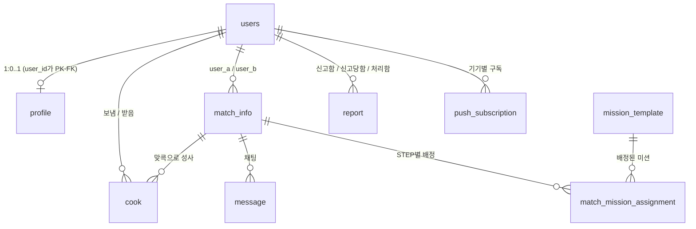

| 테이블 | 한 행이 뜻하는 것 | 주요 제약 |
| --- | --- | --- |
| `users` | 계정 하나(참가자·관리자·슈퍼) | `email` unique |
| `profile` | 참가자 프로필 | `user_id`가 PK이자 `users` FK |
| `cook` | A가 B에게 보낸 콕 | `(sender_id, receiver_id)` unique — 같은 상대에게 두 번 못 보냄 |
| `match_info` | 성사된 매칭 한 쌍, 미션 진행 단계, 읽음 시각 | |
| `message` | 채팅 메시지 | `client_message_id` unique — 재전송해도 한 번만 저장 |
| `mission_template` | 미션 문구(묶음 단위로 STEP 1~3) | |
| `match_mission_assignment` | 매칭별로 배정된 미션 | |
| `report` | 신고 | 신고자·대상·처리자 모두 `users` FK |
| `push_subscription` | 브라우저 푸시 구독(기기마다) | `(user_id, endpoint)` unique |
| `event_limit_lock` | 데이터 없는 잠금용 행 1개 | 행사 전체 하루 콕 한도를 동시에 지키려고 잠근다(3.3장) |

컬럼 전체는 [ERD.md](./ERD.md).

### 5.2 마이그레이션 (Flyway)

테이블 구조를 바꿀 때는 기존 파일을 고치지 않고 **다음 번호의 새 파일**을 만든다. 서버가 켜질 때 Flyway가 아직 적용하지 않은 파일만 순서대로 실행한다. 운영 설정은 `ddl-auto: validate`라서, 엔티티와 테이블이 어긋나면 서버가 뜨지 않는다(Hibernate가 테이블을 멋대로 바꾸지 않음).

| 파일 | 바꾼 것 |
| --- | --- |
| `V1__init.sql` | 초기 테이블 전체 |
| `V2__add_password_hash_to_users.sql` | `users.password_hash`(비밀번호 로그인) |
| `V3__add_match_read_state.sql` | `match_info`의 두 사람별 마지막 읽은 시각 |
| `V4__add_random_missions.sql` | `mission_template`, `match_mission_assignment` |
| `V5__add_event_limit_lock.sql` | `event_limit_lock`(행사 전체 한도 잠금용) |
| `V6__replace_mission_templates_with_bundles.sql` | 미션을 STEP 1~3 묶음 단위로 교체 |

---

## 6. 배포·운영

### 6.1 CI와 배포 흐름

| 언제 | 워크플로 | 하는 일 |
| --- | --- | --- |
| PR | `.github/workflows/test.yml` | `./gradlew clean check`(전체 테스트) |
| `main`에 병합 | `.github/workflows/deploy.yml` | 테스트 → 이미지 빌드·ECR 업로드 → 서버 1대씩 교체 |

`deploy.yml`의 서버 한 대 교체 순서(SSM으로 서버 안에서 실행):

1. 환경변수 파일 갱신, ECR 로그인
2. **안 쓰는 도커 이미지 정리**(`docker image prune -af`) — 디스크(8GB)가 차서 배포가 실패한 적이 있다
3. 새 이미지 받기
4. **로그 전송 사전 확인** — CloudWatch로 로그를 보낼 수 없으면 여기서 멈춘다(기존 컨테이너는 그대로)
5. 기존 컨테이너 정상 종료(`docker stop -t 30`) — 진행 중 요청을 마치고 WebSocket을 닫는다
6. 새 컨테이너 실행 → 이미지가 맞는지, `/actuator/health`가 UP인지 확인
7. ALB 헬스체크가 healthy가 되면 다음 서버로. 실패하면 **다음 서버로 넘어가지 않는다**

한 대씩 바꾸는 동안 다른 한 대가 요청을 받으므로 서비스가 끊기지 않는다. 자세한 내용은 [CICD.md](./CICD.md).

### 6.2 로그 보기

- 운영 로그는 **CloudWatch Logs** 로그 그룹 `/facecook/be`에 서버별 스트림(인스턴스 ID)으로 쌓인다. 보존 30일. 재배포해도 사라지지 않는다.
- 자주 검색하는 문구

| 검색어 | 뜻 |
| --- | --- |
| `SLOW` | 500ms 넘게 걸린 요청(`SlowRequestLoggingFilter`) |
| `Unhandled server exception` | 500 오류(`GlobalExceptionHandler`) |
| 오류 코드 이름(예: `DAILY_LIMIT`) | 해당 4xx 거절이 난 요청 |
| `푸시 발송 상태` | 30초 동안 푸시 거절·실패가 있었음(`PushDeliveryMonitor`) |
| `DB 연결 풀 상태` | 30초 동안 DB 연결을 기다린 요청이 있었음. 대기 최대 건수, 사용 중 최대/풀 크기, 연결을 얻는 데 걸린 평균 시간(`DbConnectionPoolMonitor`) |

---

## 7. 테스트

| 종류 | 예 | 무엇으로 | 특징 |
| --- | --- | --- | --- |
| 단위 테스트 | `AuthServiceTest` | JUnit + Mockito 가짜 객체 | 빠르다. 생성자로 가짜를 넣어 서비스를 직접 만든다 |
| 웹 계층 테스트 | `AuthControllerTest` | `@WebMvcTest` + `MockMvc` | 실제 URL·JSON·인터셉터·오류 처리 경로를 검증 |
| DB·Redis 통합 테스트 | `*IntegrationTest` | Testcontainers(MySQL 8.4, Redis 7) | 동시성·잠금·시간대처럼 가짜로는 못 보는 동작. **Docker가 켜져 있어야 한다** |

```bash
./gradlew --no-daemon check
```

- 한 클래스만: `./gradlew --no-daemon test --tests "com.facecook.auth.service.AuthServiceTest"`
- JDK 21이 필요하다. 기본 `java`가 다른 버전이면 `JAVA_HOME`을 21로 맞춘다.
- 동시성 테스트는 "우연히 겹치길 기다리지" 않는다. 두 스레드가 정확히 원하는 지점에서 만나도록 `CyclicBarrier`·`CountDownLatch`로 순서를 강제하고, 고친 코드를 일부러 되돌려 테스트가 실제로 실패하는지(뮤테이션 확인) 본다.
- "두 번째 요청이 첫 요청의 잠금에서 기다린다"는 것도 `sleep`으로 추측하지 않고 DB에서 확인한다. `MySqlIntegrationTestSupport.awaitLockWaiters`가 `performance_schema.data_lock_waits`(대기 중인 잠금 요청 목록)를 root 연결로 조회한다. 예전에는 `information_schema.innodb_trx`의 `LOCK WAIT`를 셌는데, 실제로 기다리는 트랜잭션이 거기 나타나지 않는 경우가 있어 미션 동시성 테스트가 가끔 실패했다(#123).

---

## 8. 따라 해보기

로컬에서 서버를 띄우고, 로그인 요청 하나가 2장의 길을 실제로 지나가는지 본다.

### 8.1 서버 띄우기

```bash
docker compose up -d
```

```bash
SESSION_SECRET=local-dev-secret-at-least-32-characters SUPER_ACCOUNT_LOGIN=super@local.test SUPER_ACCOUNT_PASSWORD=LocalSuper123! ./gradlew --no-daemon bootRun
```

- JDK 21로 실행해야 한다. `java -version`이 21이 아니면 `JAVA_HOME`을 JDK 21 경로로 맞춘 뒤 실행한다(다른 버전이면 Gradle이 알아보기 어려운 오류로 실패한다).
- 첫 기동 때 Flyway가 V1~V6을 적용하는 로그와 `SuperAccountBootstrap`의 "슈퍼 계정을 만들었습니다" 로그가 보인다.

### 8.2 비밀번호로 로그인하고 내 정보 보기

```bash
curl -i -c /tmp/cookies.txt -X POST localhost:8080/api/auth/login -H "Content-Type: application/json" -d '{"email":"super@local.test","password":"LocalSuper123!"}'
```

- 응답의 `Set-Cookie: FACECOOK_SESSION=...`이 2.3장의 토큰이다. 점(`.`) 앞부분을 base64url로 풀면 `userId:만료초`가 보인다.

```bash
curl -b /tmp/cookies.txt localhost:8080/api/auth/me
```

- 쿠키 없이 부르면 401 `UNAUTHORIZED`가 온다 — `SessionAuthenticationInterceptor`가 컨트롤러 전에 막은 것이다.

```bash
curl -i localhost:8080/api/auth/me
```

### 8.3 참가자 두 명으로 콕 → 맞콕 → 매칭

참가자 가입은 인증코드 메일이 필요하다. 로컬에 `SMTP_*`가 없으면 메일 발송이 실패하고 `VerificationCodeService`가 방금 만든 코드를 지운 뒤 502 `EMAIL_SEND_FAILED`를 돌려준다(3.1장 흐름 ①의 "메일 실패" 분기). 그래서 실습용 참가자는 DB에 직접 넣고 **비밀번호 로그인**(참가자도 쓸 수 있다)으로 들어간다.

1. 참가자 두 명과 프로필을 넣는다. 비밀번호는 둘 다 `Test1234!`이고, 아래 값은 그 BCrypt 해시다.

```bash
docker exec -i facecook-be-mysql-1 mysql -ufacecook -plocal-dev-password facecook <<'SQL'
INSERT INTO users (email, password_hash, role, status, created_at)
VALUES ('alice@local.test', '$2a$10$ckE3XhuLbLV5fdgImDwIqedeZMd.x8V1iXamUy0fkcfhkfdBsgBu6', 'participant', 'active', NOW()),
       ('bob@local.test',   '$2a$10$ckE3XhuLbLV5fdgImDwIqedeZMd.x8V1iXamUy0fkcfhkfdBsgBu6', 'participant', 'active', NOW());
INSERT INTO profile (user_id, nickname, gender, age, mbti, hobby, blood_type)
SELECT user_id, SUBSTRING_INDEX(email, '@', 1), 'F', 22, 'ENFP', '산책,영화', 'A'
FROM users WHERE email IN ('alice@local.test', 'bob@local.test');
SQL
```

2. 두 사람으로 로그인하고 userId를 확인한다(쿠키 파일을 사람마다 따로 둔다).

```bash
curl -s -c /tmp/alice.txt -X POST localhost:8080/api/auth/login -H "Content-Type: application/json" -d '{"email":"alice@local.test","password":"Test1234!"}'
```

```bash
curl -s -c /tmp/bob.txt -X POST localhost:8080/api/auth/login -H "Content-Type: application/json" -d '{"email":"bob@local.test","password":"Test1234!"}'
```

   응답의 `userId`를 아래 `{alice}`, `{bob}` 자리에 넣는다.

3. alice가 bob에게 콕을 보낸다 → `"status":"pending","matched":false`

```bash
curl -s -b /tmp/alice.txt -X POST localhost:8080/api/cooks -H "Content-Type: application/json" -d '{"receiverId":{bob}}'
```

4. bob의 콕 목록을 본다 → `received`에 alice의 `pending` 콕, `usage.todayUsed`는 아직 0(bob은 보낸 적 없음)

```bash
curl -s -b /tmp/bob.txt localhost:8080/api/cooks
```

5. bob도 alice에게 보낸다(맞콕) → `"status":"matched","matched":true,"matchId":...` — 이 한 요청 안에서 매칭이 만들어졌다(3.3장 흐름의 `alt` 분기)

```bash
curl -s -b /tmp/bob.txt -X POST localhost:8080/api/cooks -H "Content-Type: application/json" -d '{"receiverId":{alice}}'
```

6. 매칭 목록과 오류 응답을 확인한다.

```bash
curl -s -b /tmp/alice.txt localhost:8080/api/matches
```

```bash
curl -s -b /tmp/alice.txt -X POST localhost:8080/api/cooks -H "Content-Type: application/json" -d '{"receiverId":{bob}}'
```

   두 번째 명령은 409 `ALREADY_MATCHED`다(검사 순서상 "이미 매칭"이 "이미 보냄"보다 먼저). 서버 로그에도 `POST /api/cooks - ALREADY_MATCHED userId=...` 경고가 남는다(2.5장).

7. DB에서 결과를 본다 → 두 콕이 `matched`로 같은 `match_id`를 가리키고, `match_info`에는 작은 userId가 `user_a_id`로 들어가 있다(3.4장).

```bash
docker exec facecook-be-mysql-1 mysql -ufacecook -plocal-dev-password facecook -e "SELECT cook_id, sender_id, receiver_id, status, match_id FROM cook ORDER BY cook_id DESC LIMIT 2; SELECT match_id, user_a_id, user_b_id, matched_at FROM match_info ORDER BY match_id DESC LIMIT 1;"
```

### 8.4 채팅까지 해 보려면

채팅 전송은 WebSocket이라 curl로는 어렵다. facecook-fe를 로컬로 띄우고(`NEXT_PUBLIC_API_BASE_URL=http://localhost:8080`) 일반 창과 시크릿 창에서 alice·bob으로 각각 로그인해 채팅방을 열면 된다. 운영시간(09:00~18:00) 밖이면 `CLOSED`가 나므로, 서버를 띄울 때 `CHAT_OPEN_TIME=00:00 CHAT_CLOSE_TIME=23:59`를 함께 준다. 메시지를 보낸 뒤 `GET /api/matches/{matchId}/messages`로 저장된 이력을 확인할 수 있다.

### 8.5 관리자로 미션 완료 처리해 보기

8.3에서 만든 매칭으로 이어서 한다. `{matchId}`는 8.3의 5단계 응답에 있다.

1. 관리자 계정을 넣고 로그인한다(비밀번호 `Test1234!`).

```bash
docker exec facecook-be-mysql-1 mysql -ufacecook -plocal-dev-password facecook -e "INSERT INTO users (email, password_hash, role, status, created_at) VALUES ('admin@local.test', '\$2a\$10\$ckE3XhuLbLV5fdgImDwIqedeZMd.x8V1iXamUy0fkcfhkfdBsgBu6', 'admin', 'active', NOW());"
```

```bash
curl -s -c /tmp/admin.txt -X POST localhost:8080/api/auth/login -H "Content-Type: application/json" -d '{"email":"admin@local.test","password":"Test1234!"}'
```

2. alice가 미션을 본다 → `"currentStep":1`, `"currentMission":"..."`. 처음 보는 매칭이라 이 조회에서 묶음 하나가 배정됐다(3.6장 흐름 ①).

```bash
curl -s -b /tmp/alice.txt localhost:8080/api/matches/{matchId}/mission
```

3. alice가 관리자 API를 부르면 403 `FORBIDDEN` — 관리자 컨트롤러가 첫 줄에서 역할을 확인한다.

```bash
curl -s -b /tmp/alice.txt -X POST localhost:8080/api/admin/missions/{matchId}/complete -H "Content-Type: application/json" -d '{"expectedStep":1}'
```

4. 관리자가 STEP 1을 완료한다 → `"currentStep":2`, `"step1CompletedBy":{관리자 userId}`. 같은 명령을 한 번 더 보내면 409 `MISSION_STEP_MISMATCH`다(이미 처리된 STEP — 3.6장 흐름 ②).

```bash
curl -s -b /tmp/admin.txt -X POST localhost:8080/api/admin/missions/{matchId}/complete -H "Content-Type: application/json" -d '{"expectedStep":1}'
```

5. alice가 다시 보면 STEP 2 문구가 나온다. 채팅방을 FE로 열어 두었다면 WebSocket(`/topic/mission/{matchId}`)으로 새로고침 없이 바뀐다.

```bash
curl -s -b /tmp/alice.txt localhost:8080/api/matches/{matchId}/mission
```

6. 배정과 진행을 DB에서 본다 → 배정 3행이 같은 묶음의 템플릿이고, `match_info.current_step`이 2다.

```bash
docker exec facecook-be-mysql-1 mysql -ufacecook -plocal-dev-password facecook -e "SELECT step, mission_template_id FROM match_mission_assignment WHERE match_id = {matchId}; SELECT current_step, step1_completed_at, step1_completed_by FROM match_info WHERE match_id = {matchId};"
```

### 8.6 신고하고 관리자가 정지해 보기, 슈퍼 계정으로 열람하기

8.3·8.5에서 만든 alice·bob·관리자로 이어서 한다.

1. alice가 bob을 신고한다 → `"status":"pending"`. 응답의 `reportId`를 아래 `{reportId}`에 넣는다.

```bash
curl -s -b /tmp/alice.txt -X POST localhost:8080/api/reports -H "Content-Type: application/json" -d '{"reportedUserId":{bob},"reason":"실습용 신고"}'
```

2. 관리자가 목록과 두 사람의 채팅을 본다(채팅을 안 했다면 `[]`).

```bash
curl -s -b /tmp/admin.txt localhost:8080/api/admin/reports
```

```bash
curl -s -b /tmp/admin.txt localhost:8080/api/admin/reports/{reportId}/chat
```

3. `suspend`를 빼고 처리하면 400 `VALIDATION`이다. 넣어서 정지와 함께 처리한다 → `"status":"reviewed"`, `"reviewedBy":{관리자 userId}`. 같은 명령을 다시 보내면 409 `REPORT_ALREADY_REVIEWED`다.

```bash
curl -s -b /tmp/admin.txt -X POST localhost:8080/api/admin/reports/{reportId}/resolve -H "Content-Type: application/json" -d '{}'
```

```bash
curl -s -b /tmp/admin.txt -X POST localhost:8080/api/admin/reports/{reportId}/resolve -H "Content-Type: application/json" -d '{"suspend":true}'
```

4. bob의 쿠키는 아직 유효하지만, 다음 요청에서 403 `SUSPENDED`를 받고 쿠키가 지워진다(`Set-Cookie`의 `Max-Age=0`). 다시 로그인해도 403 `SUSPENDED`다.

```bash
curl -i -b /tmp/bob.txt localhost:8080/api/auth/me
```

5. 관리자 통계를 본다. `activeToday`는 오늘 로그인한 상태로 요청을 보낸 계정 수라, 이 실습의 alice·bob·관리자·슈퍼가 모두 들어간다(bob은 정지됐지만 정지 전 오늘 요청한 기록이 남아 있다).

```bash
curl -s -b /tmp/admin.txt localhost:8080/api/admin/stats
```

6. 슈퍼 계정(8.2)으로 전체 채팅방을 본다. 관리자 쿠키로 같은 주소를 부르면 403 `FORBIDDEN`이다.

```bash
curl -s -b /tmp/cookies.txt localhost:8080/api/super/chats
```

```bash
curl -s -b /tmp/admin.txt localhost:8080/api/super/chats
```

### 8.7 정리

실습 데이터(이메일이 `@local.test`로 끝나는 계정과 그 신고·콕·메시지·미션 배정·매칭·프로필)를 자식 행부터 지운다.

```bash
docker exec facecook-be-mysql-1 mysql -ufacecook -plocal-dev-password facecook -e "DELETE r FROM report r JOIN users u ON r.reporter_id = u.user_id WHERE u.email LIKE '%@local.test'; DELETE c FROM cook c JOIN users u ON c.sender_id = u.user_id WHERE u.email LIKE '%@local.test'; DELETE m FROM message m JOIN users u ON m.sender_id = u.user_id WHERE u.email LIKE '%@local.test'; DELETE a FROM match_mission_assignment a JOIN match_info mi ON a.match_id = mi.match_id JOIN users u ON mi.user_a_id = u.user_id WHERE u.email LIKE '%@local.test'; DELETE mi FROM match_info mi JOIN users u ON mi.user_a_id = u.user_id WHERE u.email LIKE '%@local.test'; DELETE p FROM profile p JOIN users u ON p.user_id = u.user_id WHERE u.email LIKE '%@local.test'; DELETE FROM users WHERE email LIKE '%@local.test';"
```

---

## 9. 용어집

| 용어 | 뜻 |
| --- | --- |
| 콕 | 마음에 드는 참가자에게 보내는 관심 표시. 하루 보낼 수 있는 수가 정해져 있다 |
| 맞콕 | 두 사람이 서로 콕을 보낸 상태. 매칭이 성사된다 |
| 매칭 | 맞콕으로 성사된 두 사람. 채팅방과 미션이 생긴다 |
| 미션 STEP | 매칭된 두 사람이 부스에서 수행하는 1~3단계 과제. 관리자가 완료를 확인한다 |
| 행사 전체 한도 | 행사일(9/30~10/2)에 모든 참가자를 합쳐 하루 보낼 수 있는 콕 수 |
| 참가자 / 관리자 / 슈퍼 | 계정 역할(`UserRole`). 관리자는 부스 운영진, 슈퍼는 전체 열람 권한 |
| 세션 쿠키 | `FACECOOK_SESSION`. 서명된 토큰(userId + 만료)이 들어 있다 |
| 접속 기록(presence) | 지금 WebSocket으로 연결된 사용자 명단(Redis). 연결돼 있으면 푸시를 보내지 않는다 |
| 빈(Bean) | 스프링이 만들어 관리하는 객체 |
| 엔티티 | DB 테이블 한 행과 연결된 객체(`@Entity`) |
| DTO | API 요청·응답 본문 모양(주로 `record`) |
| N+1 | 목록 1번 조회 후 항목마다 추가 조회가 N번 나가는 문제 |
| 트랜잭션 | 여러 DB 작업을 다 되거나 다 안 되게 묶는 단위(`@Transactional`) |
| 행 잠금 (`FOR UPDATE`) | 읽으면서 그 행을 잠가, 같은 행을 잠그려는 다른 트랜잭션을 기다리게 하는 것 |
| 멱등성 | 같은 요청을 여러 번 보내도 한 번 보낸 것과 결과가 같은 성질(채팅의 `clientMessageId`) |
| STOMP | WebSocket 위에서 보내기(SEND)·구독(SUBSCRIBE)을 표현하는 약속 |
| Pub/Sub | 발행하면 구독 중인 쪽이 모두 받는 방송. 저장하지 않는다(Redis 채널) |
| 하트비트 | 연결이 살아 있는지 확인하려고 주기적으로 주고받는 신호(10초) |
| 미션 묶음(bundle) | STEP 1~3이 한 세트로 만들어진 미션 문구 묶음. 매칭 하나에 묶음 하나가 통째로 배정된다 |
| VAPID | 웹 푸시에서 서버가 비밀키로 요청에 서명하고, 푸시 서버가 공개키로 확인하는 방식 |
| 정지(suspended) | 신고 처리 때 관리자가 고르는 계정 상태. 다음 요청부터 모든 API·채팅이 403 `SUSPENDED` |
| 프로젝션 | 엔티티 대신 필요한 열만 담는 조회 결과 타입(인터페이스의 getter로 받음) |
| `ApplicationRunner` | 스프링 기동이 끝난 직후 한 번 실행되는 코드(슈퍼 계정 생성) |
| best-effort | 최선을 다하지만 실패해도 원래 작업을 실패로 만들지 않는 부가 처리(푸시, 실시간 발행) |
